# TP1 - Pandas y Visualización de datos

## Primera parte - Pandas (15 )

Vamos a utilizar como dataset los csvs de [esta carpeta](https://drive.google.com/drive/folders/1aluo8daHgFMn40ndeBkpRMzE4hN00cEj) correspondientes a un recorte de los datos de Yelp.

Yelp es un sitio donde se pueden dejar reseñas y tips sobre negocios de todo tipo, muy utilizado en Estados Unidos. Los csvs son:

* businesses.csv
  * business_id
  * name
  * address
  * city
  * state
  * postal_code
  * latitude
  * longitude
  * stars: float, star rating, rounded to half-stars
  * review_count
  * is_open
  * attributes: un json con atributos variados
  * categories: lista de categorías en json a las que pertenece el negocio
  * hours: diccionario json con horarios día por día en los que abre
* review.csv
  * review_id
  * user_id
  * business_id
  * stars: entero entre 1 y 5
  * date
  * text: texto de la review
  * useful: cantidad de gente que la voto útil
  * funny: cantidad de gente que la voto divertida
  * cool: cantidad de gente que la votó como cool
* user.csv
  * user_id
  * name
  * review_count
  * yelping_since: fecha de registro
  * friends: lista en json de user ids que son amigos
  * useful: cantidad de votos “useful” que recibió el usuario
  * funny: cantidad de votos “funny” que recibió el usuario
  * cool: cantidad de votos “cool” que recibió el usuario
  * fans: cantidad de fans que tiene el usuario
  * elite: lista json con los años que el usuario fue élite
  * average_stars: promedio de rating de todas sus reviews
  * compliment_*: la cantidad de cumplidos de tipo * que recibió el usuario
* checkins.csv: Las visitas que los usuarios registran a los lugares
  * business_id
  * date: lista de fechas separadas por coma de los chekins que recibió el negocio
* tip.csv: tips que los usuarios dan sobre lugares
  * text
  * date
  * compliment_count: cumplidos que recibió el tip
  * business_id
  * user_id

### Consignas a realizar

❗⚠️ Debajo están las consignas del TP entero, deberá realizar **las que le toquen según la tabla que se encuentra al final**. ⚠️❗

Tienen asignados **1 ejercicio que vale un** , **4 que valen dos**  y **2 que valen tres** . Además tienen almenos un ejercicio de compresión, visualizaciones y NLP.

#### Pandas y Python

* **P1** (). ¿Cuál es el estado con mejor rating promedio en sus negocios? ¿Por qué?
* **P2** (). ¿Quién es el usuario más antiguo en el sitio que tiene exactamente 250 fans?
* **P3** (). Para el promedio de stars por cada ciudad, ¿cuáles son los 5 promedios más comunes?
* **P4** (). Muestre el nombre del usuario que ha hecho una review al mismo lugar mas veces, y también el nombre del lugar.
* **P5** (). De los 3 estados con más ciudades, indique la cantidad de ciudades y el promedio de stars de las ciudades por cada uno de los 3 estados
* **P6** (). Para los negocios que indican su horario, calcule la probabilidad de que un negocio esté abierto a las 21 horas del domingo. Si el domingo no apareciera en el diccionario asuma que no abre.
* **P7** (). Teniendo en cuenta las reviews que reciben los locales, devolver una del local que haya recibido más votos del tipo divertido en sus reviews.

* **P8** (). Para los usuarios que tengan más de 100 reviews registradas, ¿cuál es el user_id cuya mediana del tiempo entre reviews es menor?
* **P9** (). ¿Cuál es el nombre del segundo usuario que hizo reviews a más referencias geográficas?
* **P10** (). ¿Cual es el nombre del usuario que hizo más reviews en el estado de California?
* **P11** (). ¿Cuál es el código postal del local cuyas reviews suman más  votos obtenidos de ‘cool’, ‘funny’ y ‘useful’?
* **P12** (). ¿Cuál es el restaurante mexicano más cercano a FIUBA?  Datos ubicación FIUBA: Latitud:-34.61748 – Longitud:-58.36824.
* **P13** (). Nos vamos a quedar dos días en New Orleans por una meetup de data science. Queremos visitar la ciudad pero no tenemos mucho tiempo así que visitaremos sus mejores lugares. Vamos a calcular el score de review promedio para cada lugar, pero para tener en cuenta la varianza vamos a restarle a cada promedio su desviación estándar y solo usar lugares con más de 10 reviews.
  * Nos han dicho que la ciudad tiene un barrio francés con muy buena gastronomía. ¿Cúal es el mejor lugar para comer con la categoría “French”?
  * Después de comer queremos ir a un bar a tomar tragos, ¿cuál es el mejor de la categoría “Bars”?
  * ¿Cuál es el mejor museo (categoría “Museums”)? ¿De qué trata?
* **P14** (). Ginebra planea mudarse a la ciudad de Santa Bárbara. Con ella llevará a su perro "Gin". Es por esto, que quiere saber cuales son las reviews del local más cercano a la ubicación donde ha logrado alquilar un departamento de venta de artículos para mascotas, dado que es una compradora compulsiva de juguetes para él. También devolver la distancia euclídea. El departamento se encuentra en las coordenadas: 34.424137, -119.690012.
* **P15** (). ¿Cuál es el usuario más quejumbroso por estado? Consideramos quejumbroso a un usuario que tiene más de 5 reviews y son todas de 2 estrellas o menos.
* **P16** (). La antigüedad promedio de los usuarios y el nombre del usuario más antiguo cuyas última review contenga la palabra 'pizza'
* **P17** (). Queremos saber cuáles son los negocios más sexys, para esto vamos a ver cuáles son los 3 el negocios con más tips que contengan el texto "sexy"
* **P18** (). Yelp tiene la teoría de que quienes hacen las reviews más útiles en la plataforma son aquellos usuarios con más antigüedad. Para probar está hipótesis para cada review consiga la suma total de sus votos (funny + cool + useful) y correlacionela con la antigüedad del usuario *al momento de hacer la review*.
* **P19** (). Fernando quiere festejar su cumpleaños, que cae jueves, al salir de la oficina a las 19 hs. Sus amigos viven distribuidos en la ciudad de Philadelphia, por lo que es indiferente la ubicación del lugar, siempre y cuando esté en la ciudad. Quiere que le ofrezcamos el top 3 de lugares de comida italiana, generando el ranking según la cantidad de reviews de 5 estrellas que hayan recibido. Devolver algunas referencias (al azar) de cada uno de ellos, para ayudarlo a  decidir en cual realizar la reserva.
* **P20** (). Buscar la distancia mínima que existe entre dos locales de McDonald 's en el estado de LA (que no comparten dirección). ¿Cuál es la distancia?¿A qué ciudad/es pertenecen? ¿Cuáles son las direcciones de los locales?
* **P21** (). Queremos saber cuáles son los negocios más sexys, para esto vamos a ver cuáles son los 3 el negocios con más tips que contengan el texto "sexy"
* **P22** (). ¿Cúal es la correlación entre el score que deja un usuario en una review, y el score que dejó en la anterior? Tenemos la teoría de que un usuario tiende a dejar reviews similares. Puede tomar un sample para calcularla.
* **P23** (). ¿Cúal es la correlación entre el score que dejaron los usuarios en cada review después de 2017, y el score promedio que dejaron en todas las reviews del 2017? Calcule sin usar samples.
* **P24** (). ¿Quién es el usuario con al menos un fan con mayor ratio amigos/fans?
* **P25** (). Yelp quiere reconocer qué usuarios están progresando en el sitio de manera excepcional respecto a la mayoría para darles una medallita. El problema es que todos los usuarios tienen distintas edades en el sitio y eso dificulta medir progreso. Calcule la velocidad con que cada usuario consiguió fans e hizo reviews en el sitio. ¿Cuántos usuarios superan ambas velocidades promedio?
* **P26** (). Verifique si el valor de stars en business.csv es válido y consistente. ¿Qué porcentaje del campo es válido?
* **P27** (). De los negocios que tienen acceso para silla de ruedas (si no dice nada asuma que no tiene) y tienen más de 10 reviews, ¿cuál es el mejor? ¿y el peor?

* **P28** (). Queremos saber donde vive alguno de nuestros usuarios, para los usuarios que tiene más de 50 registros a negocios distintos en la tabla reviews obtenga el promedio y desviación estándar de la latitud y longitud de los negocios que calificaron (contando cada negocio una sola vez). Para el usuario que menos desviación estándar sumada tenga de ambas coordenadas muestre ese promedio y dónde está eso ([https://www.gps-coordinates.net/](https://www.gps-coordinates.net/)) y cómo se llama el usuario para después irlo a buscar a la casa.
* **P29** (). Queremos recomendarle lugares al usuario ‘bNnBwW5kNO77KTgMeVhxKg’. Para esto vamos a decir que a un usuario le gusto un lugar si le dio 3 estrellas o más y tomamos sólo los usuarios que hayan realizado más de 10 reviews. Vamos a buscar al usuario que más lugares le gusten en común y recomendarle todos aquellos que a ese le gustaran y le falte hacer review.
* **P30** (). Según la [paradoja de la amistad](https://www.youtube.com/watch?v=httLvVufAYs), en redes sociales, tus amigos suelen tener en promedio más amigos que vos :(. Calcule el promedio de amigos que tiene cada usuario y el promedio de amigos que tienen los amigos de cada usuario.
* **P31** (). Según la teoría de los 6 grados de separación, en redes sociales, las personas tienen 6 amigos de separación entre sí. Esto es, si queres llegar a contactar a cualquier persona en el mundo, estás a una cadena de 6 amigos para llegar a esa persona. ¿Qué proporción de usuarios están a distancia menor o igual a 1 y menor o igual a 2 entre sí? Utilice una muestra (muestra de que?)
* **P32** (). Estime la centralidad de cada usuario por medio de random walks sobre sus amigos. ¿Quién es el usuario más popular?
* **P33** (). Para las reviews y tips que contienen la palabra “fuck”:
  * Para las reviews, ¿cuál es el promedio del score?
  * ¿Cuál es el usuario que más veces usó la palabra en ambas tablas?
  * ¿Cuál es el negocio que más veces recibió la palabra en ambas tablas?
  * ¿Cuál es el negocio de más de 3 reviews con mayor ratio de textos que contienen “fuck”?
  * Para los negocios con textos que tienen “fuck” correlacione el rating promedio del negocio con su ratio de “fuck” en textos.

#### NLP

* **N1** (). ¿Cúal es el top 10 palabras más comunes para los textos de los tips? Puede usar split como tokenizer, considere las palabras en minúscula sin contar stopwords.
* **N2** (). Utilizando los textos de las reviews y las técnicas de NLP(TF-IDF), de modo que la query sea 'high quality', devolver el nombre de la pizzería, la review y la ciudad, que haya sido reconocida por la calidad de sus productos.
* **N3** (). La 3-upla de palabras (no letras) más común en los comentarios de los tips. De ser necesario, se puede utilizar un sample y no la totalidad de datos.
* **N4** (). ¿Cuál es el la review con menor ratio de stopwords en función de su longitud para aquellas que tienen por lo menos 100 caracteres?
* **N5** (). Utilizando los textos de las reviews para realizar consultas por texto y empleando las técnicas de NLP(TF-IDF), de modo que la query "bad smell" devuelva el “business_id” que haya recibido una crítica acerca una experiencia de malos olores en el local.
* **N6** (). Uno de los mayores problemas de las reviews es que los usuarios tienen distintas escalas en puntaje para las mismas experiencias, entonces las estrellas que suele dejar un usuario no son comparables con las otro. Para normalizar un poco más esto, Yelp quiere que el usuario primero escriba el texto y según qué tan positivo o negativo sea sugerirle la cantidad de estrellas a dejar. vaderSentiment y textblob de python son dos librerías para analizar sentimientos, ambas pueden darnos un score de que tan positivo o negativo es el sentimiento de un texto. Para los textos reviews, cuál de los dos scores de emoción mejor correlaciona con el puntaje que esa review deja?
* **N7** (). Yelp tiene la sensación de que mientras más objetivos son los usuarios mejor valoradas son sus opiniones. textblob es una librería que nos permite calcular la objetividad de un texto. Si consideramos la objetividad promedio de las reviews de un usuario (para usuarios con más de 20 reviews), y su cantidad de fans, obtenga una visualización similar. Puede tomar un sample (sample de qué? cuidado!)
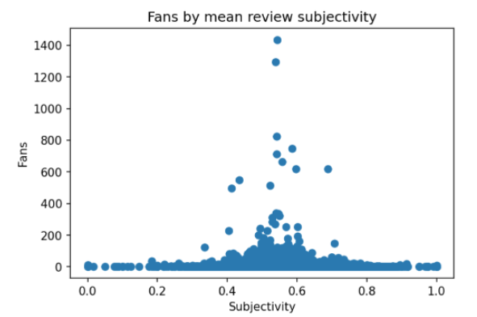
* **N8** (). Queremos crear nuestro propio clasificador de reviews según sean positivas o negativas usando los datos de yelp, para hacer esto vamos a hacer una cosa muy sencilla: asignarle a cada palabra de las 500 más comunes sin contar stopwords el promedio de las stars para las reviews en las que aparece, luego, cuando aparezca un nuevo texto para las palabras que conozcamos del mismo promediamos sus scores. Por ejemplo, si tenemos las palabras “buena” con polaridad 3.4 y “rica” con polaridad 4.3 y tenemos el texto “buena y rica” su predicción será 3.85. Puede usar una muestra para entrenar. ¿Cuál es la salida del predictor para “I loved this place, the food was amazing!”?

#### Compresión

* **C1** (). Calcule la entropía de Shannon (base 2) del campo stars de reviews
* **C2** (). Calcule la entropía de Shannon (base 2) de la pertenencia a las categorías de los negocios.
* **C3** (). Utilizando la declaración universal de los derechos humanos en [español](https://www.ohchr.org/sites/default/files/UDHR/Documents/UDHR_Translations/spn.pdf) y [portugues](https://www.oas.org/dil/port/1948%20Declara%C3%A7%C3%A3o%20Universal%20dos%20Direitos%20Humanos.pdf) y utilizando la distancia normalizada de compresión, encuentre una review en español y otra en portugues (puede tomar un sample siempre y cuando sea capaz de encontrar eso en el sample).
* **C4** (). Si tomamos una muestra de negocios con más de 10 reviews y todas sus reviews como un texto concatenado, en términos de distancia de compresión normalizada para esos textos, cuáles son los dos negocios más parecidos? Muestrelos sus textos y distancia.
* **C5** (). Comprima todos los textos de las reviews obteniendo un ratio de compresión mejor que 2.
  * ¿De cuanto es el ratio de compresión?
  * ¿Cuánto tarda en comprimir y descomprimir (por separado)? (use el _magic_ %%timeit)
  * ¿Cuánto ocupa cada carácter en promedio una vez comprimido?
  * Si tomamos la entropía base dos para los caracteres ¿cuánto da? ¿cuantos bytes por caracter son esos?
  * Si utilizaramos un árbol de huffman por caracter, aproximadamente ¿cuál sería el ratio de compresión en el caso más optimista?
  * ¿Cúal algoritmo de compresión sería mejor?
* **C6** (). Para las reviews que superaron el cuantil 0.95 en votos funny, calcular la probabilidad de aparición de una de estas reviews para cada día de la semana. Hacer lo mismo con votos cool. Calcular la entropía de ambas y la divergencia de kullback leibler entre ellas. Interpretando estos resultados responder:
  * ¿Cuál de los dos eventos es más difícil de predecir?
  * ¿Cuál de estas distribuciones de probabilidades aproxima peor a la otra?
* **C7** (). Para aquellos negocios que tengan más de 5 sucursales y su distribución probabilística de sucursales por ciudad. Calcule la divergencia de Kullback Leibler entre todos los negocios:
  * ¿Por qué dan casi todas infinito? Para corregirlo recalcule todo sumando 1*10^-10 en el denominador del logaritmo.
  * ¿A qué negocios y en qué sentido corresponde la menor divergencia de Kullback Leibler? (recordar que la divergencia es dirigida)
  * ¿Cuál es el negocio con mejor divergencia de Kullback-Leibler respecto de Burger King? ¿Y de McDonalds?
* **C8** (). Yelp tiene la teoría de que mientras más variadas y “ricas” son las reviews de un usuario más popular es. Mientras más variadas son las reviews de un usuario, más difíciles son de comprimir. Por otro lado, mientras más textos se comprimen más fácil es lograr un buen ratio de compresión por lo que vamos a quedarnos con los usuarios que hicieran más de 200 reviews. ¿Cómo se correlaciona el ratio de compresión de todas las reviews de cada uno de esos usuarios con su cantidad de fans?

#### Visualizaciones
* **V1** (). Consiga **exactamente** esta visualización utilizando los datos:
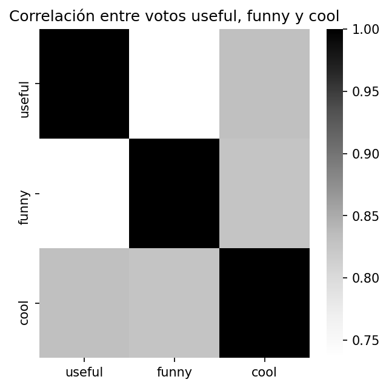
* **V2** (). Consiga **exactamente** esta visualización utilizando los datos:
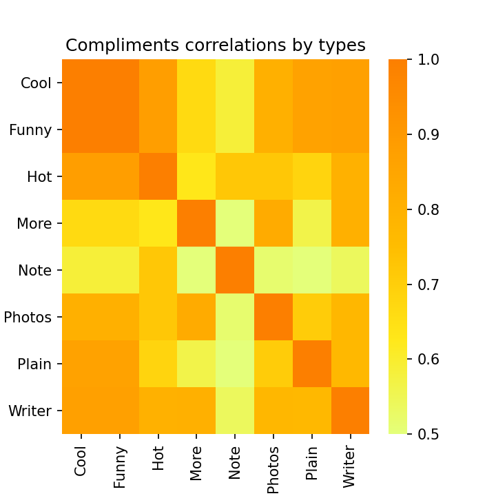
* **V3** (). Consiga **exactamente** esta visualización utilizando los datos:
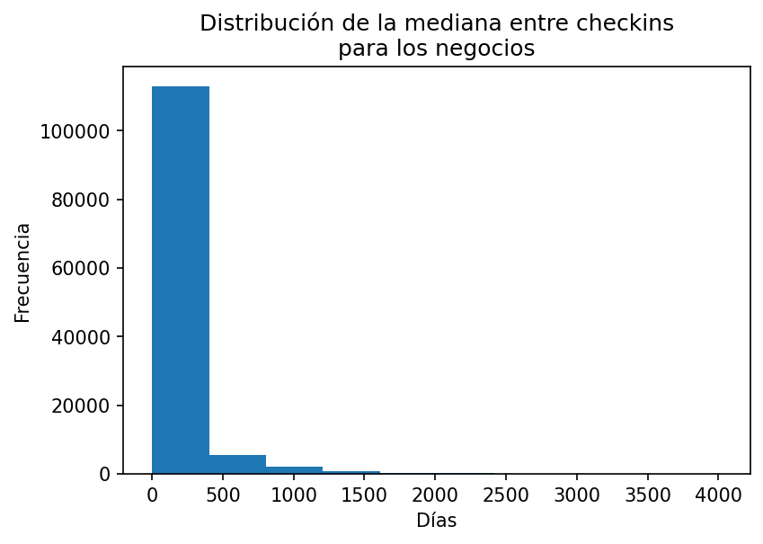
* **V4** (). Consiga **exactamente** esta visualización utilizando los datos:
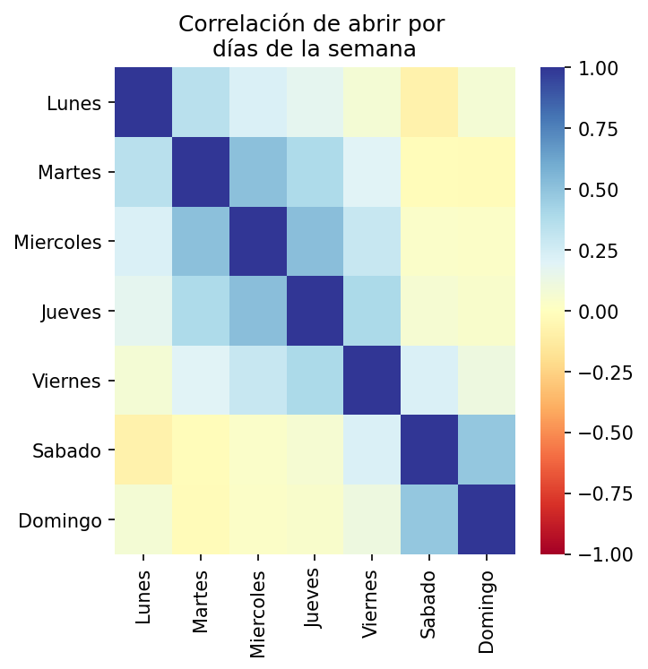
* **V5** (). Consiga **exactamente** esta visualización utilizando los datos:
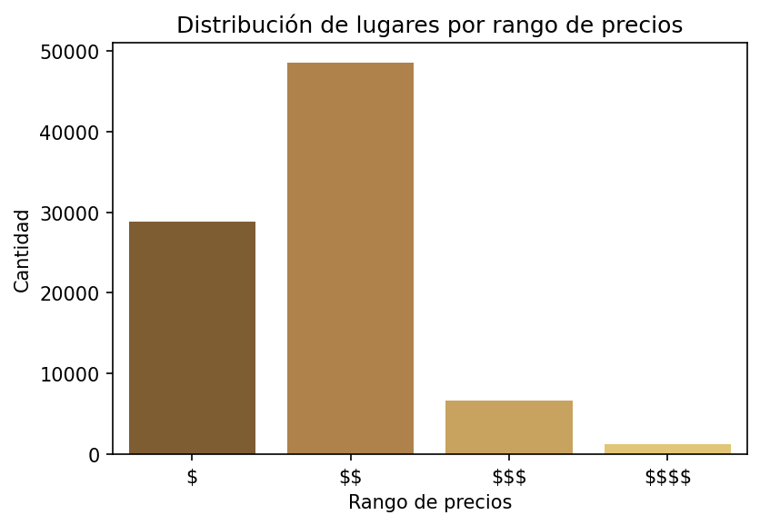
* **V6** (). Consiga **exactamente** esta visualización utilizando los datos:
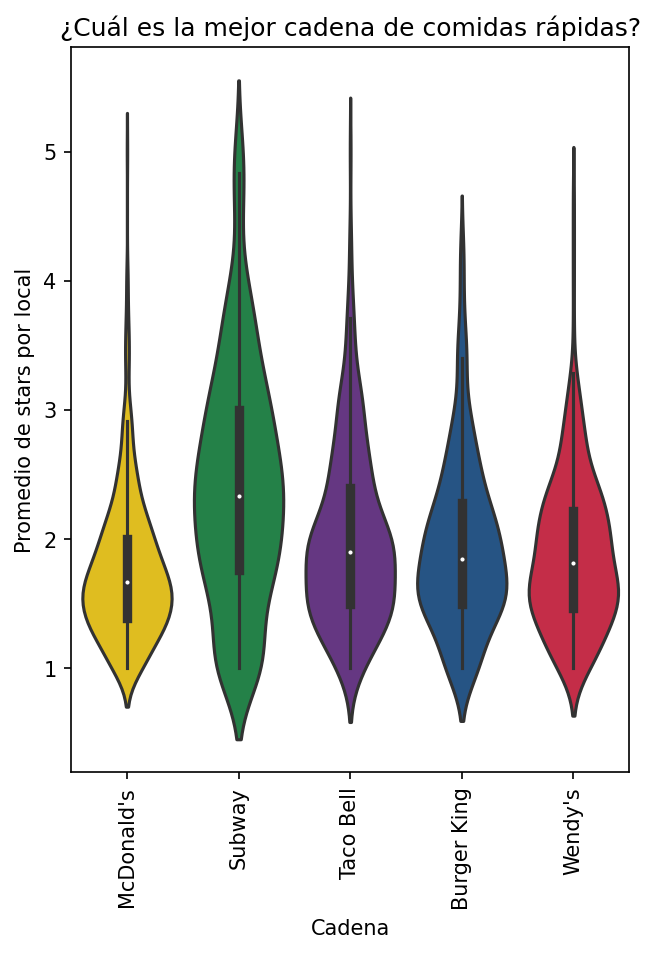
* **V7** (). Consiga **exactamente** esta visualización utilizando los datos:
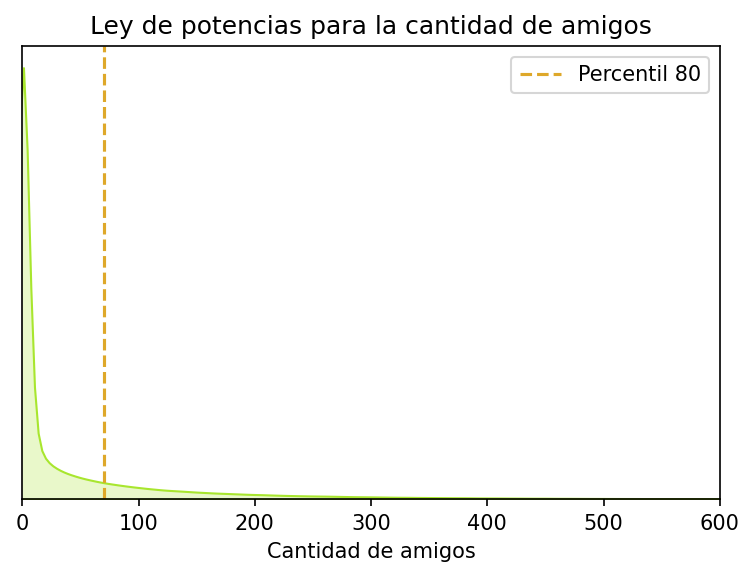
* **V8** (). Consiga **exactamente** esta visualización utilizando los datos:
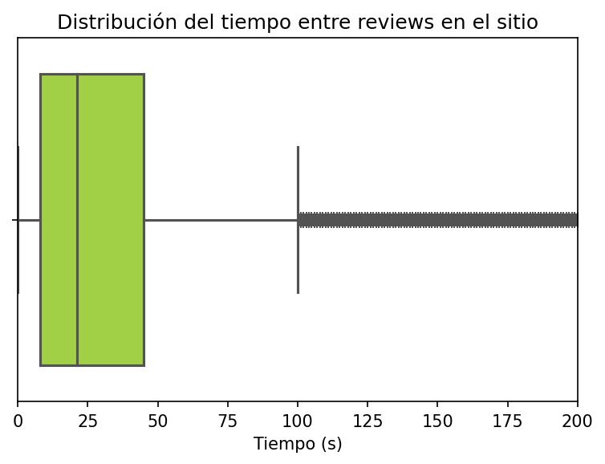
* **V9** (). Consiga **exactamente** esta visualización utilizando los datos. Consideramos que un negocio está en una ubicación compartida si su dirección es usada por más de un negocio.
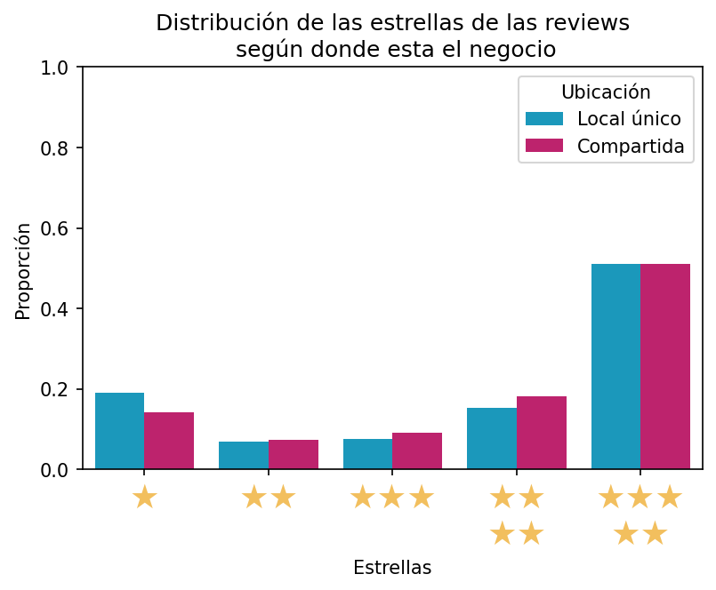
* **V10** (). Consiga **exactamente** esta visualización utilizando los datos:
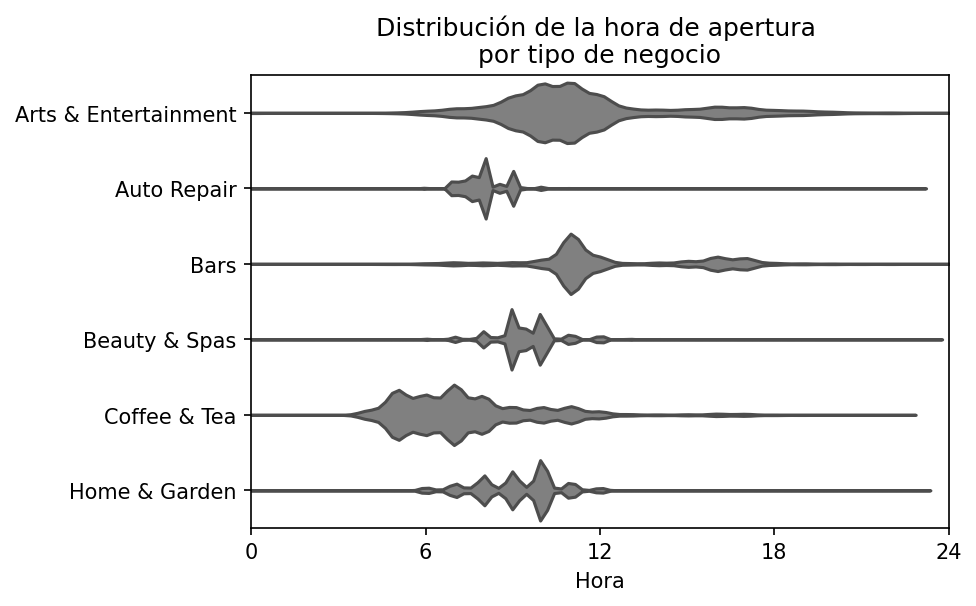

## Segunda parte - Visualización de datos (10 )

1) (6 ) Realizar dos visualizaciones para cada uno de los tres datasets que elija de los que le brindamos. Las visualizaciones deben incluir o ayudar a explicar la variable indicada encontrando alguna relación **interesante** con ella (esto es excluyente). Además se debe realizar almenos un plot de cada uno de los siguientes tipos:
  * Bar plot (o sus variaciones)
  * Histograma
  * Violin plot
  * Box plot
  * Heatmap

Debe elegir tres de los siguientes datasets:
  * [Flight delays dataset](https://www.kaggle.com/competitions/flight-delays-spring-2018/data) incluyendo la variable dep_delayed_15min.
  * [House prices](https://www.kaggle.com/competitions/house-prices-advanced-regression-techniques/data?select=train.csv) incluyendo la variable SalePrice.
  * [Sysarmy sueldos 2022.1](https://docs.google.com/spreadsheets/d/1h7VSFV2xkbgUi3kmJMVzCtX3RajwkzqdIyQkOsyathw/edit#gid=765652237) incluyendo la variable "Salario mensual o retiro BRUTO (en tu moneda local)".
  * [Amazon Seller - Order Status Prediction](https://www.kaggle.com/datasets/pranalibose/amazon-seller-order-status-prediction) incluyendo la variable order_status.
  * [Keeping it Fresh: Predict Restaurant Inspections](https://www.drivendata.org/competitions/5/keeping-it-fresh-predict-restaurant-inspections/page/28/) incluyendo las variables \*, \*\* ó \*\*\*.
  * [Job Salary Prediction](https://www.kaggle.com/competitions/job-salary-prediction/data) incluyendo la variable SalaryNormalised.
  * [Influencers in social media](https://www.kaggle.com/competitions/predict-who-is-more-influential-in-a-social-network/data) incluyendo la variable Choice.
  * [Warm Up: Predict Blood Donations](https://www.drivendata.org/competitions/2/warm-up-predict-blood-donations/page/7/) incluyendo la variable "Made Donation in March 2007".
  * [Rain in Australia](https://www.kaggle.com/datasets/jsphyg/weather-dataset-rattle-package) incluyendo la variable Rainfall.
  * [Disney Movies](https://www.kaggle.com/datasets/prateekmaj21/disney-movies?select=disney_movies.csv) incluyendo la variable inflation_adjusted_gross.

2) () Utilice alguna herramienta para realizar diagramas (por ejemplo Google Draw, draw.io, Google Slides, HTML, Illustrator, Photoshop, alguna lib de Python novedosa, etc.) para crear una visualización **ORIGINAL** que no pueda realizarse de forma directa con las librerías más comunes de Python, puede utilizar las librerías de Python como paso intermedio. Puede realizar este punto sobre los datos de: cualquier dataset, estadística oficial, paper, estadística no oficial, encuesta, números sin ninguna fuente en un blog, etc. El objetivo es elegir un tema de su interés y comunicarlo de forma efectiva y agradable.

## Puntos extra (hasta tres )

Utilizamos el promedio del puntaje normalizado de cada kahoot/parcialito para armar un podio.
Quien esté primero recibira tres , quienes estén segundos o terceros recibiran dos  extra. Quienes estén en cuarto y quinto puesto un  extra.

### Podio actual (update: 11/04)

El podio se modificara a medida participen en los Kahoots.

|   Padrón | Alumno                       |   Puntos | Premio   |
|---------:|:-----------------------------|---------:|:--------|
|   100972 | PEREZ LEIRAS, AGUSTIN TOMAS  | 0.952829 |        |
|   105771 | MANGIATERRA, FEDERICO CARLOS | 0.882652 |        |
|    99642 | CAPRA, FRANCO DANIEL         | 0.868644 |        |
|   105798 | GRÜNER, TOMÁS                | 0.836209 |        |
|   102649 | PAGURA, SEBASTIAN MARTIN     | 0.823364 |        |

## Criterio de aprobación

El criterio general es que la totalidad del tp tiene que sumar 15 puntos de los 25, es un 60%. Además todas las consignas deben estar desarrolladas, entregando algo en cada una.

Cada une va a tener algún ayudante asignado, pueden hacer consultas por slack a su ayudante o en el canal.

### Primera parte - Pandas

Todos los ejercicios valen lo mismo que los  que tienen asignados.

* Cada ejercicio se considera 100% correcto si:
  * Resuelve lo pedido (¡cuidado con casos bordes! ¡revisen todo lo que pueda ser NULL!): Si el ejercicio no resuelve al 100% lo pedido, se considera que vale como máximo la mitad.
    * Cada ejercicio deberá funcionar si los datos cambian, esto significa, por ejemplo, que no podemos buscar un valor en una tabla y copiar y pegar ese literal para buscar en otra. El código debe soportar que la respuesta cambie.
  * Lo hace de la forma más eficiente posible: Si el ejercicio no está resuelto de la forma más óptima, pierde la mitad de su valor.
* La idea es que no lo hagan solos! Las consignas son complejas de entender en una sola lectura y necesitan pensarse lento, por esto es que es crucial consultar. Para esto hacemos lo siguiente según el tipo de duda:
  * Dudas de consigna:
    * Van a poder consultar en el canal de slack #consultas-tp1, es MUY importante que antes de consultar vean si su duda no fue resuelta allí.
    * En caso de no haber sido resuelta previamente para organizarnos sigan el siguiente formato: "**codigo de consigna** - Su consulta...". De esta forma es más facil para todos buscar consultas del pasado, por ejemplo: "C7 - No entiendo como calcular el largo en bytes que ocuparía con un árbol de Huffman.". **NO** se debe incluir código de resolución ni en la consulta ni interactuando con otres compañeres.
  * Dudas para saber si se puede usar alguna librería:
    * Se hacen en el mismo formato que las dudas de consigna.
  * Dudas de código y optimización:
    * Si son dudas generales de "cómo se hace <algo> en pandas" se puede consultar en el canal de consultas o en las clases de consulta.
    * El resto de las dudas deben consultarse con su ayudante asignado.

### Segunda parte - Visualización de datos

1. Cada visualización vale un  de los seis y debe cumplir con las siguientes condiciones:
  * Debe explicarse por si misma, sin necesidad de texto aclaratorio.
  * Debe tener rótulos en los ejes que corresponda y en el título.
  * Debe mostrar una relación o algo con la variable pedida que sea claro e interesante.
  * El uso de color debe ser intencional, elegido por ustedes, no por la librería.
  * La visualización debe ser legible (por ejemplo, un bar plot de 40 barras es ilegible)
2. Debe cumplir con el objetivo propuesto: Les recomendamos preguntar en clases de consultas o por slack, vamos a estar guiandolos en este punto. Dado que la elección de este dataset es personal pueden ir compartiendo sus ideas/bocetos o consultar lo que quiera sobre este punto de forma pública en #consultas-tp1 o si lo prefieren en privado con su ayudante.

Valoramos que se ayuden entre ustedes, debatan y compartan ideas y tips en el canal de slack!

## Asignaciones

El equipo NIL (Nahuel Spieguelman, Ignacio Argel y Lucas Bilo) se fusiono en uno y van a responder consultas todos juntos, por lo que por favor si les tocaron escribanles a los 3 juntos.

|   Padron | Nombre                              | 1 -    | 2 -    | 3 -    | 4 -    | 5 -    | 6 -    | 7 -    | Ayudante asignado                                   |
|---------:|:------------------------------------|:--------|:---------|:---------|:---------|:---------|:----------|:----------|:----------------------------------------------------|
|   107143 | CALDERON, GONZALO MANUEL            | N1      | P21      | N5       | V3       | C2       | V10       | N7        | Ignacio Brusati                                     |
|   101830 | DE SANTIS, FEDERICO EZEQUIEL        | P4      | V4       | V7       | N3       | C2       | V9        | P33       | Gianmarco Cafferata                                 |
|   108183 | DIAZ, JUAN MANUEL                   | P1      | P8       | N6       | V6       | C2       | C6        | P31       | Lucas Waisten                                       |
|   104424 | FERNANDEZ FOX, JOEL ISAAC           | V1      | V8       | P21      | N2       | C3       | P31       | P33       | NIL: Nahuel Spieguelman, Ignacio Argel y Lucas Bilo |
|   105027 | GOMEZ, THIAGO EZEQUIEL              | V1      | P15      | P10      | C2       | N4       | P32       | N7        | Matias Rotondo                                      |
|   105906 | GRUSS, OLIVIER ANTOINE              | P4      | P10      | P23      | N6       | V8       | C5        | N8        | Ignacio Brusati                                     |
|   101933 | KARAGOZ, FILYAN                     | P2      | P20      | V2       | N5       | C3       | P28       | P32       | Damian Martinelli                                   |
|   106148 | METZ, MIGUEL GABRIEL                | P2      | C2       | V5       | N6       | P17      | C8        | C4        | NIL: Nahuel Spieguelman, Ignacio Argel y Lucas Bilo |
|   108221 | PAVON, MARIA DOLORES                | P2      | P17      | P14      | V2       | N5       | C4        | P29       | Damian Martinelli                                   |
|   101946 | PUQUIO ROJAS, GIANCARLO JOSE        | P6      | C2       | P26      | N5       | V8       | N8        | P28       | Gianmarco Cafferata                                 |
|   106016 | VAGÓ, NICOLÁS ESTEBAN               | C1      | P25      | P23      | V2       | N5       | C4        | N8        | Manuel Battan                                       |
|    97023 | YBARRA ESCALANTE, DIEGO EMANUEL     | P1      | P26      | P20      | C2       | V7       | N8        | V9        | Esteban Djeordjian                                  |
|   105829 | AGAMA  AVILA, ANNALI ARELY          | P5      | P12      | P20      | V6       | N6       | C5        | P31       | Julieta Ponti                                       |
|   104221 | AGUILAR, PEDRO                      | P6      | N6       | P16      | V6       | C3       | V9        | P32       | Damian Martinelli                                   |
|   100199 | AGUIRRE, ARIEL LEANDRO              | P5      | N3       | P25      | V8       | C3       | P28       | C4        | Matias Fusco                                        |
|    79558 | ALBORNOZ, ROMINA CARLA              | C1      | P21      | P19      | V7       | N2       | P31       | P28       | Lucas Waisten                                       |
|   101589 | ALVAREZ, JUAN MANUEL                | P3      | V6       | N3       | C3       | P17      | C4        | P28       | Matias Fusco                                        |
|   105081 | AVENDAÑO PADILLA, FRANZ JULIO       | P1      | P22      | C2       | V3       | N3       | N7        | V10       | Damian Martinelli                                   |
|   104482 | AVILA CABRERA, GASTON               | P2      | V2       | P13      | N3       | C3       | P30       | P33       | Lucas Waisten                                       |
|    98592 | BLOISE, JULIETA                     | P4      | N6       | P22      | V6       | C3       | C8        | P32       | Manuel Battan                                       |
|   104733 | BRASBURG, AGUSTIN                   | P6      | P27      | P18      | V4       | N5       | C8        | C6        | NIL: Nahuel Spieguelman, Ignacio Argel y Lucas Bilo |
|   106211 | BULNES, MATEO                       | P6      | V5       | P19      | N2       | C3       | P29       | N7        | NIL: Nahuel Spieguelman, Ignacio Argel y Lucas Bilo |
|   102842 | CALIZ BLANCO, ALEJO MARTIN EZEQUIEL | P5      | P11      | P17      | V2       | N3       | C7        | P29       | Damian Martinelli                                   |
|    99676 | CANTERO, ALAN EZEQUIEL              | P1      | P15      | V3       | N5       | C2       | P33       | P29       | Esteban Djeordjian                                  |
|    99642 | CAPRA, FRANCO DANIEL                | P5      | P16      | N2       | V3       | C2       | P32       | C4        | Ignacio Brusati                                     |
|   106551 | CASTRO, NAHUEL ELIAS                | C1      | N3       | N4       | P18      | V7       | P30       | V10       | Gianmarco Cafferata                                 |
|    99879 | CLAROS CASTRO, ELVIS                | N1      | N2       | P8       | V7       | C3       | P28       | C8        | Damian Martinelli                                   |
|   102104 | COSTA, LUCIANO                      | P3      | V2       | V5       | N4       | C2       | C7        | C5        | Damian Martinelli                                   |
|   104098 | CUPPARI, FRANCO                     | P6      | V7       | P9       | N4       | C3       | V9        | C8        | NIL: Nahuel Spieguelman, Ignacio Argel y Lucas Bilo |
|   106855 | DAHAB, MOISES TOMAS                 | P7      | P16      | N2       | V6       | C2       | C7        | N8        | Gianmarco Cafferata                                 |
|   106368 | DELLA VECCHIA, TOMAS                | P4      | P20      | P14      | V6       | N3       | C8        | C5        | Esteban Djeordjian                                  |
|   104525 | DEMARCHI, LUCAS                     | P4      | P17      | P11      | V2       | N6       | C7        | P30       | NIL: Nahuel Spieguelman, Ignacio Argel y Lucas Bilo |
|   105122 | DIAZ CALIXTO, LUZ MILAGROS          | N1      | P11      | P24      | V4       | C3       | V10       | P32       | Ignacio Brusati                                     |
|   104581 | DUZAC, JUAN MARTIN                  | P7      | P14      | N6       | V5       | C3       | P30       | P33       | Gianmarco Cafferata                                 |
|   106295 | ENCINOZA VILELA, NATHALIA LUCIA     | P1      | V3       | V2       | N4       | C2       | C7        | V10       | Gianmarco Cafferata                                 |
|   103992 | ESPERON, RAMIRO                     | P3      | P22      | P15      | C2       | V8       | N7        | V9        | Matias Rotondo                                      |
|   103512 | FERNANDEZ BOCH, VALERIA ALEJANDRA   | P7      | P12      | P11      | V5       | N2       | C5        | V9        | Gianmarco Cafferata                                 |
|    81006 | FERNANDEZ, OMAR ALFREDO             | N1      | N3       | V8       | P19      | C3       | P31       | N8        | Gianmarco Cafferata                                 |
|    86125 | FONZALIDA, MIGUEL ANGEL             | V1      | V6       | P9       | C3       | N6       | P32       | P30       | Manuel Battan                                       |
|   102396 | FRESIA, JUAN PABLO                  | N1      | N5       | P16      | V4       | C2       | P30       | C6        | Gianmarco Cafferata                                 |
|   102184 | FUENTES, AZUL LUCILA                | P7      | P27      | P12      | N5       | V7       | C6        | P29       | Gianmarco Cafferata                                 |
|    97490 | GALLO, ROCIO MARIANA                | P1      | P25      | P21      | V5       | N3       | C7        | C6        | Gianmarco Cafferata                                 |
|   105552 | GENERAL, CAMILA                     | C1      | P19      | P17      | V8       | N5       | C6        | P32       | Damian Martinelli                                   |
|   106514 | GOMEZ, NAHUEL NICOLAS               | P2      | P18      | C3       | V3       | N2       | P33       | C5        | Ignacio Brusati                                     |
|    88060 | GORDILLO, LUIS ALEJANDRO            | C1      | P12      | N5       | V3       | P18      | P29       | V10       | Matias Rotondo                                      |
|   104623 | GRAZIOSI, GERMAN                    | N1      | P24      | V7       | C3       | P21      | V10       | P29       | Gianmarco Cafferata                                 |
|   105798 | GRÜNER, TOMÁS                       | N1      | P23      | P27      | V6       | C2       | P33       | C5        | Gianmarco Cafferata                                 |
|   105553 | JALEH, FEDERICO EZEQUIEL            | P5      | N2       | C3       | V4       | P19      | P31       | V9        | Damian Martinelli                                   |
|    99093 | JAMILIS, NETANEL DAVID              | P6      | P13      | N3       | V4       | C3       | P33       | P28       | Damian Martinelli                                   |
|    94727 | JARMOLINSKI, ARIAN LUCAS            | P7      | C2       | V8       | N4       | P21      | P29       | C7        | Damian Martinelli                                   |
|    87796 | LA TORRE, GABRIEL                   | P7      | P15      | P20      | V8       | N6       | C5        | P30       | Gianmarco Cafferata                                 |
|   105931 | LAZZARO, MELINA                     | P3      | P25      | C3       | N4       | V7       | N8        | C8        | NIL: Nahuel Spieguelman, Ignacio Argel y Lucas Bilo |
|   100589 | LEGUIZAMON, VERONICA BEATRIZ        | P3      | P23      | P25      | V8       | N5       | C6        | C5        | Matias Rotondo                                      |
|   106223 | LITTERI, IVAN                       | V1      | N4       | P13      | C2       | P19      | N7        | P29       | NIL: Nahuel Spieguelman, Ignacio Argel y Lucas Bilo |
|   104002 | LOSCOCCO, IGNACIO ARIEL             | P5      | P24      | N4       | V8       | C3       | P33       | P30       | Gianmarco Cafferata                                 |
|   105771 | MANGIATERRA, FEDERICO CARLOS        | C1      | P8       | P19      | V8       | N5       | P28       | C6        | Gianmarco Cafferata                                 |
|   105994 | MARCHESINI, SOFIA                   | N1      | P26      | V8       | C3       | P9       | P30       | C7        | Julieta Ponti                                       |
|   105554 | ORQUERA LORDA, FRANCISCO            | V1      | V4       | P10      | C3       | N3       | C4        | C7        | Julieta Ponti                                       |
|   102256 | OSCO CABRERA, ALEJANDRO ABRAHAM     | V1      | P9       | P27      | N6       | C2       | C4        | V10       | Esteban Djeordjian                                  |
|   102649 | PAGURA, SEBASTIAN MARTIN            | P5      | V8       | C2       | N3       | P21      | P28       | P31       | NIL: Nahuel Spieguelman, Ignacio Argel y Lucas Bilo |
|   102679 | PALAZON, MARTIN                     | V1      | P21      | P13      | N3       | C2       | V9        | P31       | NIL: Nahuel Spieguelman, Ignacio Argel y Lucas Bilo |
|   100972 | PEREZ LEIRAS, AGUSTIN TOMAS         | P3      | P26      | N2       | V7       | C3       | P29       | C8        | Damian Martinelli                                   |
|    98230 | PERRONE, PATRICIO NAHUEL            | P7      | P16      | P27      | V5       | N2       | C8        | C7        | Gianmarco Cafferata                                 |
|   104229 | PONT TOVAR, MARIA FERNANDA          | C1      | P13      | P9       | V8       | N6       | C6        | P30       | Esteban Djeordjian                                  |
|    91076 | PORRAS CARHUAMACA, SHERLY KATERIN   | P3      | V4       | P22      | N5       | C2       | V9        | P30       | Damian Martinelli                                   |
|    91561 | PRIETO, PABLO ALEJANDRO             | P5      | N5       | V4       | C3       | P17      | P28       | N8        | Gianmarco Cafferata                                 |
|   105703 | RONDAN, MARCELO ARIEL               | N1      | N5       | V7       | P21      | C2       | V10       | P28       | Matias Fusco                                        |
|   106280 | RUEDA, NAZARENA                     | P1      | V6       | N6       | C2       | P17      | P33       | P28       | Lucas Waisten                                       |
|   105558 | SALESE D'ASSARO, ARIANA MAGALÍ      | P2      | V3       | V2       | N2       | C3       | C7        | N7        | Matias Rotondo                                      |
|   105637 | SANTANDER, VALENTIN                 | C1      | P9       | P15      | N5       | V8       | N8        | P31       | Damian Martinelli                                   |
|    99131 | SECCHI, ANA MARIA                   | P7      | P19      | V4       | N3       | C2       | C6        | N8        | Julieta Ponti                                       |
|   106422 | SILVA, PATRICIO TOMAS               | V1      | P18      | P8       | N2       | C3       | C4        | C8        | Gianmarco Cafferata                                 |
|    93735 | SOSA AQUINO, RICARDO ARIEL          | P6      | N4       | V5       | C2       | P19      | C6        | P31       | Esteban Djeordjian                                  |
|    98741 | SOSA, CRISTIAN MARTIN               | P4      | C3       | P24      | V4       | N3       | C8        | C5        | Julieta Ponti                                       |
|   104909 | TAIBO, NAZARENO GABRIEL             | P1      | C3       | P24      | V7       | N6       | P31       | V10       | Esteban Djeordjian                                  |
|    97617 | YAVICOLI, TOMAS                     | P2      | P18      | P14      | C2       | V8       | N7        | C6        | NIL: Nahuel Spieguelman, Ignacio Argel y Lucas Bilo |
|    96995 | Matías Priano                       | P2      | V3       | V6       | N6       | C2       | V9        | C4        | Matias Fusco                                        |
|    93751 | José Israel Ramírez                 | P4      | P8       | P12      | V5       | N4       | C5        | N7        | Damian Martinelli                                   |
|    87039 | Zoraida Flores Sosa                 | P7      | P17      | P18      | V2       | N6       | C5        | C7        | Gianmarco Cafferata                                 |
|   100488 | Carlos Martín Stefanelli D'elias    | P3      | P10      | P23      | N5       | V8       | C5        | C4        | Damian Martinelli                                   |
|    97540 | Facundo Brondo                      | V1      | P14      | P10      | N3       | C3       | C4        | P32       | Gianmarco Cafferata                                 |
|    98559 | Nicolas Allende                     | P4      | V5       | P22      | N4       | C2       | V9        | P33       | Gianmarco Cafferata                                 |
|    96467 | José Eduardo Chávez Cabanillas      | P1      | P11      | V6       | N3       | C2       | P33       | P30       | Lucas Waisten                                       |
|   101186 | Mauro Giampietri                    | C1      | N4       | P26      | V4       | P19      | C8        | V9        | Esteban Djeordjian                                  |
|    97640 | Facundo Brondo                      | P6      | V7       | V3       | C3       | N6       | V10       | C7        | NIL: Nahuel Spieguelman, Ignacio Argel y Lucas Bilo |
