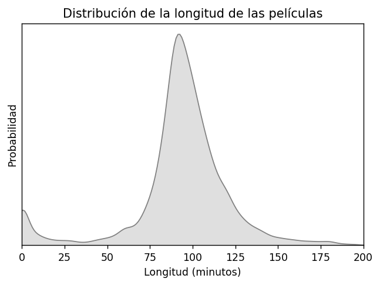
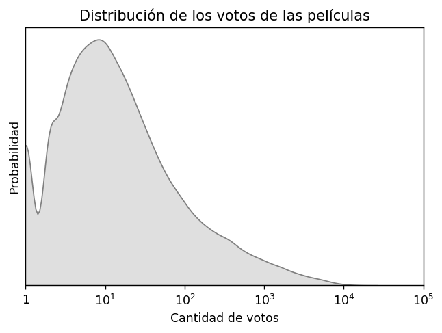
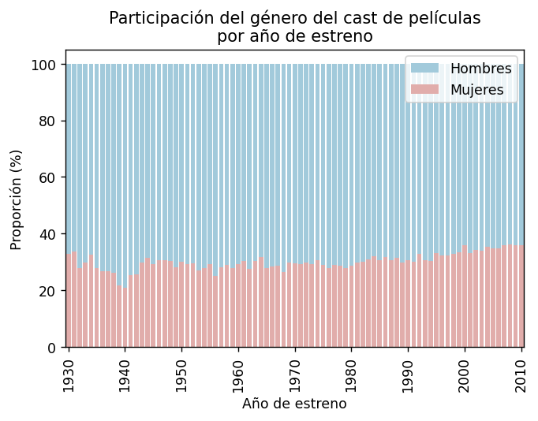
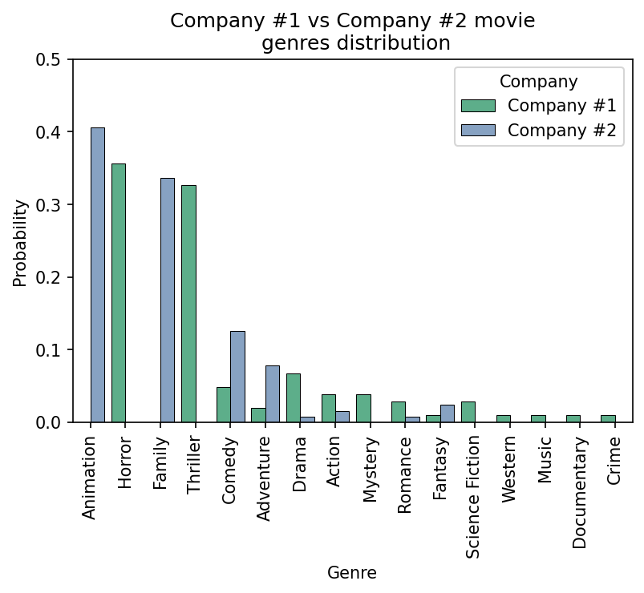
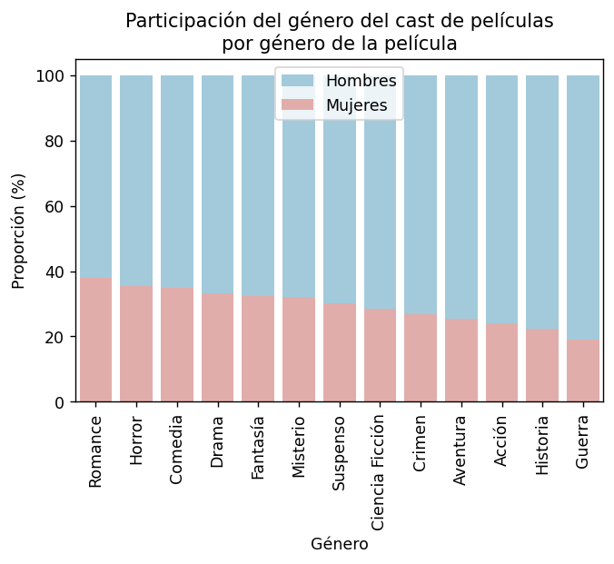
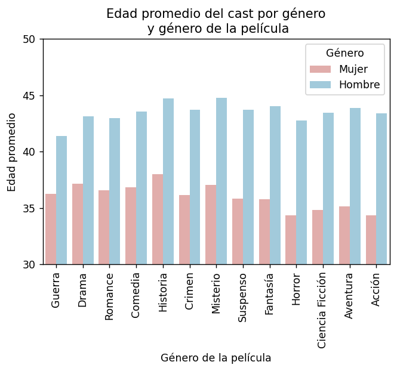

# TP1 - Pandas y Visualización de datos

## Primera parte - Pandas (15 )

Vamos a utilizar como dataset los csvs de [esta carpeta](https://drive.google.com/drive/folders/1fOBnuxITZSsbChHfmrvw8rQt_D_SyJ18). Es una mezcla del dataset de “the movie database” para 45mil películas y datos de imdb.

Los csvs son:

* Movies.csv
  * adult: 😏🥵
  * belongs_to_collection: Nombre de la colección a la que pertenece la película
  * budget: presupuesto
  * genres: géneros separados por coma
  * homepage: web de la peli
  * id: id de la peli
  * imdb_id: id de la película en imdb
  * original_language: idioma original
  * original_title: título en el idioma original
  * overview: descripción de la película
  * popularity: popularidad
  * poster_path: ruta a la imagen del poster
  * production_companies: id de las empresas que produjeron la película, separadas por comas
  * production_countries: países donde se produjeron las películas
  * release_date: fecha de estreno
  * revenue: ingresos que generó
  * runtime: largo total en minutos
  * spoken_languages: idiomas que se hablan en la película
  * status: estado de la película
  * tagline: eslogan
  * title: título en inglés
  * video
  * vote_average: promedio de calificaciones
  * vote_count: cantidad de votos
* cast.csv
  * id: id de película en la que participó
  * cast_id: id de la persona
  * character: personaje que hizo
  * name: nombre
* crew.csv
  * id: id de la película en la que participó
  * crew_id: id de la persona
  * department: departamento en el que trabajo
  * job: título de su trabajo
  * name: nombre
* companies.csv
  * id: id de la compañía
  * name: nombre
* keywords.csv
  * id: id de la película
  * keywords: palabras clave separadas por coma
* ratings.csv
  * userId: user que dejó el rating
  * movieId: película donde lo dejó
  * rating: el rating que dejó, del 1 al 5
  * timestamp: timestamp de cuando dejó el rating
* imdb_actors.csv: Es un csv extra que sale de imdb que contiene información de muchos actores y actrices
  * nconst: id de la persona
  * primaryName: nombre
  * birthYear: año de nacimiento
  * deathYear: año de muerte
  * primaryProfession: profesiones principales separadas por comas
  * knownForTitles: ids de imdb por los cuales se lo conoce, separado por comas
* links.csv
  * movieId: un ID único para cada película
  * imdbId: el id de imdb de esa película
  * tmdbId: el ID de “the movie database” que aparece en la mayoría de las otras tablas

### Consignas a realizar

❗⚠️ Debajo están las consignas del TP entero, deberá realizar **las que le toquen según la tabla que se encuentra al final**. ⚠️❗

Tienen asignados **1 ejercicio que vale un** , **4 que valen dos**  y **2 que valen tres** . Además tienen almenos un ejercicio de compresión, visualizaciones y NLP.

#### Pandas y Python

* **P1** (). ¿Cuáles son las 5 lenguas en las que más ganancia neta genera la industria aproximado por los datos propuestos? y las 5 que menos? (ganancia neta = ganancia - inversión)
* **P2** (). De las 10 películas más populares, ¿cuál es el título de la película que tiene más géneros asociados? ¿Cuáles son esos géneros?
* **P3** (). ¿Cuál es la película con el mayor ratio ingreso por minuto? ¿Y el cortometraje? Dar nombres y ratios. Criterio: Película > 30min>= Cortometraje >= 5min.
* **P4** (). ¿Cuál es el nombre del actor o actriz que participó en más películas en un rol que no sea de voz (‘voice’)? ¿En cuántas películas trabajó? ¿De quién se trata y por qué es conocida?
* **P5** (). Para las películas que duran más de tres horas, ¿cuál es la película con más ROI?
* **P6** (). Para las películas que contienen el género de acción, si las separamos entre películas antes del 2000 y después del 2000, ¿cuál es el promedio de cantidad de votos para cada etapa?
* **P7** (). ¿Cúal es el porcentaje de películas que contienen a su título en la descripción?
* **P8** (). ¿Cuál es el nombre de la película con mayor cantidad de empleados contratados para trabajar en Efectos Visuales?
* **P9** (). De las películas que están siendo rumoreadas, ¿cuál es el título de la que presenta el presupuesto más alto?
* **P10** (). Calcular la probabilidad de que al seleccionar un actor del registro aún esté vivo/no se haya documentado su muerte.
* **P11** (). ¿Cúal fue el año más mortal para los actores y actrices?
* **P12** (). Se desea encontrar a los 10 usuarios menos objetivos. Se considera a un usuario poco objetivo cuando sus calificaciones a las películas están muy alejadas de la media.
* **P13** (). Según los cinéfilos, ¿cuál es el rating promedio de las 5 películas más populares? Un usuario es cinéfilo cuando puntuó más de 50 películas y todas las puntuaciones son de más de 2.5 estrellas. Indicar id, título, popularidad y rating promedio de la película.
* **P14** (). Top 10 películas Argentinas según vote_average que contengan el género drama con más de 100 reviews en ratings (dar géneros, cantidad de reviews en ratings, título, y vote_average).
* **P15** (). Si decimos que un usuario es adyacente a otro cuando le dieron un rating a una misma película. ¿Cuántos usuarios son adyacentes al 179792? ¿Cuántos son adyacentes a sus adyacentes?
* **P16** (). ¿Cúal es el usuario cuya velocidad promedio para hacer ratings es mayor?
* **P17** (). Si consideramos la antigüedad de un usuario como la diferencia entre el tiempo en el que hizo el primer rating y la última. ¿Cúal es el usuario más antiguo? ¿Cúal es la correlación entre la antigüedad de cada usuario y la cantidad de reviews que hizo?
* **P18** (). Queremos saber quién de los 2 actores le gusta más a la gente, si Guillermo Francella o Ricardo Darin, para eso queremos saber quien tiene en promedio mejor vote_average en movies.csv.
* **P19** (). ¿Cuál es el nombre del mejor actor o actriz de todos los que participaron en más de 10 películas? Se considera un actor mejor que otro cuando el promedio de las calificaciones promedio de las películas en las que participó es mayor que el de otro actor o actriz.
* **P20** (). ¿Cuál es la probabilidad de que una película de un género en particular tenga una calificación promedio mayor a 7? Obtenga las probabilidades de cada género posible.
* **P21** (). Para las mil keywords más comunes, obtenga la matriz de correlación entre keywords.
* **P22** (). En las películas a veces se habla en otros idiomas distintos al original, ya sea de forma continua como en Inglorius Basterds o de forma aislada como el francés en el [fín de la película Jumanji](https://youtube.com/clip/Ugkx0O8Cm976gvWM0SOy08eHU_rwos0worDK). Para los 15 idiomas más comunes hablados en las películas muestre con un heatmap sencillo la matriz de correlación entre ellos.
* **P23** (). ¿Cúal es la correlación entre la última review que recibió una película y la siguiente?
* **P24** (). ¿Qué película contiene más actores y actrices que murieron a los dos o menos años siguientes al estreno? ¿Tan mala fue la película?
* **P25** (). ¿Cuál es el género y la homepage de la película que tiene mayor cantidad de palabras claves?
* **P26** (). Uno tendería a pensar que mientras más personas participan de una película, más cara es. Realice un regression plot entre la cantidad de crew que trabajó en cada película y el presupuesto, removiendo todo lo que supere el percentil 96 para ambos números para evitar outliers. ¿Cuál es la correlación entre estos números?
* **P27** (). En todo el mundo el estado financia parcialmente al cine de las productoras locales. Una preocupación creciente es la existencia de ***ñoquis*** en las crew de las películas que son amigos o conocidos de la producción de las mismas a expensas de fondos del estado. La consultora “Espumadera” es una startup Argentina se dedica a encontrar posibles ***ñoquis*** para auditar en distintos contextos y tiene como clientes a organismos estatales de todo el mundo. Deseamos buscar anomalías para auditar en la crew de las películas, ¿Quienes superan el percentil 95 de producciones en las que participaron en roles distintos de directores, productores o escritores en el mismo año de estreno?
* **P28** (). ¿Cuáles son los actores o actrices que hicieron más películas en una misma década según la década en la que más hicieron? ¿En qué posición del top está Nicolas Cage?
* **P29** (). Construya la matriz que dadas dos productoras la posición i,j contenga la cantidad de veces que la productora i trabajo con la productora j. Considere solo productoras con más de 5 películas. Obtenga con esa matriz la matriz de correlación. Responda:
  * ¿Cuáles son las 5 productoras que trabajaron con más productoras distintas?
  * ¿Cuáles son las productoras que siempre trabajan juntas?
* **P30** (). ¿Cuál es el género con más películas cada década? ¿Y la keyword para cada década?
* **P31** (). Para las películas con ROI (Return of Investment) entre -10 y 10 consiga una serie que tenga como índice cada país donde se produjeron películas y como valores el promedio del ROI. ¿Cuáles son los 5 países más rentables para producir una película?
* **P32** (). Al parecer hay personas que además de actuar en una película también trabajaron en ella desde algún otro rol. ¿Cuál de estas personas es la que más trabajos tuvo en una misma película? Indicar el nombre de la película, el nombre de la persona y la cantidad de trabajos que tuvo.
* **P33** (). Estime la probabilidad de que, al seleccionar un rating al azar con y sin reposición, este usuario comparta alguna película vista con el 179792 que sea del mismo género que la película a la que le dejó rating.
* **P34** (). Consideremos que una persona ingresa a la población de actores y actrices cuando nace y la abandona cuando muere. Grafique la serie de tiempo de población en función del año. Definimos la tasa de natalidad y mortalidad de actores y actrices como la proporción de nacimientos y muertes sobre la población del período en el cual nacieron o murieron. Grafique las tasas de mortalidad y natalidad en función del año.
* **P35** (). Queremos hacer una película que incluya al mejor empleado para cada categoría de la tabla crews como líder de equipo. Para los empleados que participaron en más de 5 películas considerando el promedio de ratings de las películas en las que participaron, ¿Cúal es el mejor de cada tupla (department, job)? Con este mismo criterio, consiga un top 5 de actores y top 5 de actrices para el elenco de la misma. Con este mismo criterio queremos también el tema de la película, ¿cuáles son las 4 mejores keywords?
* **P36** (). Consiga una matriz cuyas columnas sean los cast id y crew ids (diferenciados para no colisionar), que tenga una fila por cada película y que los valores sean la cantidad de roles para los que esa persona participa en la película. Estime cuánto ocuparía en RAM teniendo en cuenta que cada número pesa 4 bytes, y en caso de no entrar construyala como matriz dispersa.
* **P37** (). Queremos estimar el patrón de ratings de usuarios nuevos usando un MRUV. La ecuación a estimar cantidad de ratings en función del tiempo $$Q(t) = 1 + v*t + \frac{1}{2}*a*t^2$$. ¿Qué correlación hay entre la aceleración y velocidad individual de cada usuario? Haga un scatter plot de aceleración y velocidad. ¿Qué valores de v y de a resultan de tomar las velocidades y aceleraciones promedio de todos los usuarios que dieran más de 10 ratings? Grafique la Q resultante en función de t. Grafique en otro plot las series de tiempo de 100 usuarios random para comparar que tan bueno es nuestro modelo.

#### NLP

* **N1** (). ¿Cúal es la descripción con mayor ratio de stopwords?
* **N2** (). Removiendo stopwords, ¿Cúal es el top 10 stems más comunes?
* **N3** (). Removiendo stopwords, ¿Cúal es el top 10 lemmas más comunes?
* **N4** (). ¿Cúal es el top 10 adjetivos más comunes en las descripciones de las películas?
* **N5** (). ¿Cúal es el top 10 palabras con mayor popularidad promedio, sin contar stopwords?
* **N6** (). Queremos predecir el género de la película según su descripción. Para esto vamos a buscar para una descripción nueva los 10 vecinos más cercanos y asignar el género que más se repita entre ellos. Pruebe este algoritmo para 5 películas al azar y para una descripción inventada que se le ocurra para una película nueva de Disney (su corrector valorará si logra hacerlo reír (? ).
* **N7** (). Dado el ROI de las películas, para aquellas cuyo ROI (Return of Investment) esté entre -10 y 10. ¿Cúal es el top 10 palabras que aparecen más de 5 veces y no son stopwords que generan mayor ROI promedio según su aparición en las descripciones?
* **N8** (). Encuentre, para cada película, cuál es la más cercana en términos de distancia coseno respecto de las keywords. Muestre 5 pares aleatorios con sus descripciones.
* **N9** (). Queremos analizar qué tan fácil sería hacer un slogan para las películas en base a su descripción con machine learning. La primera pregunta consiste en entender: ¿Qué porcentaje de las palabras que no son stopwords de las que aparecen en los slogans aparecen también en la descripción? ¿Y qué porcentaje de las tuplas de dos palabras cumplen eso? ¿Y tuplas de tres? A mayores los porcentajes, más fácil será generar el slogan con la descripción.
* **N10** (). La primera regla del club del cine es que no se habla del club del cine: queremos utilizar las reviews de las películas para emparejar personas cinéfilas. Dadas las descripciones de las películas que le gustaron (calificación >3) a un usuario y las que no le gustaron (calificación <3) construya dos vectores con tf-idf. Busque para cada usuario, utilizando la concatenación de estos vectores, al usuario más similar. No utilice los usuarios que tienen menos de 30 reviews (o más si no termina de funcionar), ya que no son verdaderos fans del cine. ¿Quién es el usuario con más parejas?

#### Compresión

* **C1** (). ¿Cúal es la entropía base 2 de la distribución del rating que dan los usuarios?
* **C2** (). Sin contar el género “Foreign” considerando la probabilidad de hacer una película en cada género para cada productora con más de 100 películas, ¿Cuáles son las 5 productoras con más entropía de Shannon en base 2?
* **C3** (). Para variables continuas existe la entropía diferencial, un análogo al caso discreto. Para las productoras con más de 50 películas, ¿Cúal es la productora con más y menos entropía diferencial para su ROI (Return of Investment)? ¿Qué interpretación puede hacer de esto?
* **C4** (). ¿Cúal es la productora con entropía base 2 más alta para la distribución de los idiomas originales de sus producciones?
* **C5** (). ¿Cúal es la película cuya entropía de las ratings que recibe es más alta? Esta será la película con opiniones más variadas. Considere sólo películas con más de 30 ratings.
* **C6** (). Comprima todos los textos de las descripciones de las películas obteniendo un ratio de compresión mejor que 2.
  * ¿De cuanto es el ratio de compresión?
  * ¿Cuánto tarda en comprimir y descomprimir (por separado)? (use el magic %%timeit)
  * ¿Cuánto ocupa cada carácter en promedio una vez comprimido?
  * Si tomamos la entropía base dos para los caracteres ¿cuánto da? ¿cuantos bytes por caracter son esos?
  * Si utilizaramos un compresor aritmético por caracter, aproximadamente ¿cuál sería el ratio de compresión en el caso más optimista?
  * ¿Cúal algoritmo de compresión de los dos sería mejor?
* **C7** (). Para todas las productoras obtenga una matriz cuadrada en donde la posición i,j sea la divergencia de kullback leibler entre la distribución de idiomas originales de la productora i respecto de la productora j. Grafique con `plt.imshow`. Si no le alcanza el tiempo para estos usuarios puede tomar un filtro según cantidad de películas de una productora.
* **C8** (). Tenemos la teoría de que a más películas variadas ve un usuario, más snob es, y que en consecuencia da puntajes más bajos en los ratings. Para cada usuario que hizo más de 100 reviews calcule el ratio de compresión de las descripciones de las películas que vió. ¿Cúal es la correlación entre ese ratio y el promedio del rating que deja el usuario? Si no le alcanza el tiempo para estos usuarios puede tomar un filtro de usuarios que hicieran más reviews.
* **C9** (). Para cada usuario que hizo más de 100 reviews, ¿cuáles son los dos usuarios con mayor distancia normalizada de compresión entre la concatenación de la descripción de 100 películas al azar que vieron? ¿Y con menor? Muestrelos intentando justificar por qué resultan así. Si no le alcanza el tiempo para estos usuarios puede tomar un filtro de usuarios que hicieran más reviews.

#### Visualizaciones
* **V1** (). Calcule el ROI (Return of Investment) de cada película. Filtre aquellos entre -10 y 10 y consiga la siguiente visualización.

* **V2** (). Reproduzca exactamente esta visualización

* **V3** (). Reproduzca exactamente esta visualización

* **V4** (). Reproduzca exactamente esta visualización

* **V5** (). Utilizando la tabla de imdb_actors para estimar los géneros, realice la siguiente visualización. La misma debe tener el mismo estilo y rangos pero puede variar ligeramente debido a supuestos al aproximar valores.

* **V6** (). Consiga la probabilidad de que una productora haga una película según el género para cada uno de los géneros. Para las productoras con participación total mayor a 100, ¿cuáles son las dos productoras con más distancia coseno respecto de sus probabilidades en géneros? Realice este plot reemplazando los nombres de las productoras por los que corresponden

* **V7** (). Utilizando la tabla de imdb_actors para estimar los géneros, realice la siguiente visualización. La misma debe tener el mismo estilo y rangos pero puede variar ligeramente debido a supuestos al aproximar valores.

* **V8** (). Utilizando la tabla de imdb_actors para estimar los géneros, realice la siguiente visualización. La misma debe tener el mismo estilo y rangos pero puede variar ligeramente debido a supuestos al aproximar valores.

## Segunda parte - Visualización de datos (10 )

1) (6 ) Realizar dos visualizaciones para cada uno de los tres datasets que elija de los que le brindamos. Las visualizaciones deben incluir o ayudar a explicar la variable indicada encontrando alguna relación **interesante** con ella (esto es excluyente). Además se debe realizar almenos un plot de cada uno de los siguientes tipos:
  * Bar plot (o sus variaciones)
  * Histograma o Density plot
  * Violin plot
  * Box plot
  * Heatmap

Debe elegir tres de los siguientes datasets:

* [Notificación de casos de HIV](https://datos.gob.ar/dataset/salud-notificacion-casos-vih) explicando la cantidad de casos
* [Top 200 spotify](https://www.kaggle.com/datasets/edumucelli/spotifys-worldwide-daily-song-ranking) explicando la variable position.
* [Liga argentina de futbol](https://www.kaggle.com/datasets/estebanmarcelloni/liga-argentina-futbol?resource=download) explicando quien gano, empato o perdió partidos y cuantos.
* [Transacciones SUBE 2022](https://www.datos.gob.ar/dataset/transporte-sube---cantidad-transacciones-usos-por-fecha/archivo/transporte_93410ab1-88df-457a-8e24-262d41211f9c) explicando la columna cantidad
* [Google Play Store Apps](https://www.kaggle.com/datasets/lava18/google-play-store-apps?select=googleplaystore.csv) explicando el rating.
* [Alcohol Consumption](https://www.kaggle.com/datasets/sansuthi/alcohol-consumption) explicando la variable alcconsumption

2) () Utilice alguna herramienta para realizar diagramas (por ejemplo Google Draw, draw.io, Google Slides, HTML, Illustrator, Photoshop, alguna lib de Python novedosa, etc.) para crear una visualización **ORIGINAL** que no pueda realizarse de forma directa con las librerías más comunes de Python, puede utilizar las librerías de Python como paso intermedio. Puede realizar este punto sobre los datos de: cualquier dataset, estadística oficial, paper, estadística no oficial, encuesta, números sin ninguna fuente en un blog, etc. El objetivo es elegir un tema de su interés y comunicarlo de forma efectiva y agradable.

## Puntos extra (hasta tres )

Utilizamos el promedio del puntaje normalizado de cada kahoot/parcialito para armar un podio. El podio se modificara a medida participen en los Kahoots.
Quien esté primero recibira tres , quienes estén segundos o terceros recibiran dos  extra. Quienes estén en cuarto y quinto puesto un  extra.

### Podio Kahoots

En construcción.

## Criterio de aprobación

El criterio general es que la totalidad del tp tiene que sumar 15 puntos de los 25, es un 60%. Además todas las consignas deben estar desarrolladas, entregando algo en cada una.

Cada une va a tener algún ayudante asignado, pueden hacer consultas por slack a su ayudante o en el canal.

### Criterio de reentrega

Se podrá reentregar el TP si el puntaje es >=10 y están **todos los puntos desarrollados**.  La reentrega consiste en hacer un punto extra y corregir todos los puntos donde tuvieran menos de la mitad de los puntos.

Se aprueba la reentrega si todos los puntos tienen al menos la mitad de los puntos. En caso de luego aprobar la instancia de reentrega, la nota es siempre 4.

### Primera parte - Pandas

Todos los ejercicios valen lo mismo que los  que tienen asignados.

* Cada ejercicio se considera 100% correcto si:
  * Resuelve lo pedido (¡cuidado con casos bordes! ¡revisen todo lo que pueda ser NULL!): Si el ejercicio no resuelve al 100% lo pedido, se considera que vale como máximo la mitad.
    * Cada ejercicio deberá funcionar si los datos cambian, esto significa, por ejemplo, que no podemos buscar un valor en una tabla y copiar y pegar ese literal para buscar en otra. El código debe soportar que la respuesta cambie.
  * Lo hace de la forma más eficiente posible: Si el ejercicio no está resuelto de la forma más óptima, pierde la mitad de su valor.
* La idea es que no lo hagan solos! Las consignas son complejas de entender en una sola lectura y necesitan pensarse lento, por esto es que es crucial consultar. Para esto hacemos lo siguiente según el tipo de duda:
  * Dudas de consigna:
    * Van a poder consultar en el canal de slack #consultas-tp1, es MUY importante que antes de consultar vean si su duda no fue resuelta allí.
    * En caso de no haber sido resuelta previamente para organizarnos sigan el siguiente formato: "**codigo de consigna** - Su consulta...". De esta forma es más facil para todos buscar consultas del pasado, por ejemplo: "C6 - No entiendo como calcular el largo en bytes que ocuparía con un árbol de Huffman.". **NO** se debe incluir código de resolución ni en la consulta ni interactuando con otres compañeres.
  * Dudas para saber si se puede usar alguna librería:
    * Se hacen en el mismo formato que las dudas de consigna.
  * Dudas de código y optimización:
    * Si son dudas generales de "cómo se hace <algo> en pandas" se puede consultar en el canal de consultas o en las clases de consulta.
    * El resto de las dudas deben consultarse con su ayudante asignado.

### Segunda parte - Visualización de datos

1. Cada visualización vale un  de los seis y debe cumplir con las siguientes condiciones:
  * Debe explicarse por si misma, sin necesidad de texto aclaratorio.
  * Debe tener rótulos en los ejes que corresponda y en el título.
  * Debe mostrar una relación o algo con la variable pedida que sea claro e interesante.
  * El uso de color debe ser intencional, elegido por ustedes, no por la librería.
  * La visualización debe ser legible (por ejemplo, un bar plot de 40 barras es ilegible)
2. Debe cumplir con el objetivo propuesto: Les recomendamos preguntar en clases de consultas o por slack, vamos a estar guiandolos en este punto. Dado que la elección de este dataset es personal pueden ir compartiendo sus ideas/bocetos o consultar lo que quiera sobre este punto de forma pública en #consultas-tp1 o si lo prefieren en privado con su ayudante.

Valoramos que se ayuden entre ustedes, debatan y compartan ideas y tips en el canal de slack!

## Formato de Entrega

La entrega es en Gradescope en formato PDF, pueden ver como es el formato de entrega [acá](https://docs.google.com/document/d/1me1ua4FMUtySkQOoN77QVI-4YCN--fn6KZkLmS7InaM/).

En el PDF deben indicar cada uno de los puntos de la primer parte que les tocó, colocando el enunciado de la consulta a resolver y el link al notebook donde está resuelta.

Para la segunda parte, incluír las visualizaciones en el PDF, con el link al notebook que genera cada una de ellas.

## Asignaciones

Ciertos grupos de colaboradores son un equipo, y como tal, deben contactarlos a todos juntos y no por separado.

* Ignacio Brusati y Juan Pablo Fresia
* Esteban Djeordijan y Alejo Caliz Blanco
* Julieta Ponti y Martín Stefanelli
* NIL: Nahuel Spieguelman, Ignacio Argel y Lucas Bilo
* Matias Fusco y Gabriel Semorile

|   Padron | Nombre                                | 1 -    | 2 -    | 3 -    | 4 -    | 5 -    | 6 -    | 7 -    | Ayudante asignado                                   |
|---------:|:--------------------------------------|:--------|:---------|:---------|:---------|:---------|:----------|:----------|:----------------------------------------------------|
|   105288 | Sebastián Brizuela                    | P4      | V5       | C2       | N8       | P22      | V7        | V6        | Ignacio Brusati y Juan Pablo Fresia                 |
|   107742 | ABUIN, AQUILES EZEQUIEL               | N3      | N5       | C3       | P27      | V4       | N10       | V7        | Damian Martinelli                                   |
|   104438 | BRICCHI, FRANCO                       | V3      | N4       | P14      | C4       | P32      | C8        | V6        | Esteban Djeordijan y Alejo Caliz Blanco                   |
|   107143 | CALDERON, GONZALO MANUEL              | C1      | P30      | P25      | N4       | V5       | P35       | C9        | Gianmarco Cafferata                                 |
|   108981 | CARRANZA, LIHUÉN                      | P8      | C4       | P22      | V4       | N5       | P36       | N10       | Gianmarco Cafferata                                 |
|   101830 | DE SANTIS, FEDERICO EZEQUIEL          | P5      | P26      | V5       | C4       | N8       | V8        | C8        | Damian Martinelli                                   |
|   103992 | ESPERON, RAMIRO                       | N3      | P15      | P29      | C2       | V5       | P34       | V7        | NIL: Nahuel Spieguelman, Ignacio Argel y Lucas Bilo |
|   103448 | GARCIA, NICOLAS ARIEL                 | P7      | P32      | C2       | N6       | V5       | P37       | P35       | Damian Martinelli                                   |
|    85682 | JURGENS, CECILIA INES                 | P1      | P18      | P17      | N8       | C5       | V6        | N10       | Gianmarco Cafferata                                 |
|    99839 | LESCANO MAIER, ALDANA ROCIO           | P6      | P29      | N5       | V4       | C3       | P34       | N10       | Matias Fusco y Gabriel Semorile                     |
|   107164 | MORANDI, FABRIZZIO LEONARDO           | P8      | C2       | P27      | N9       | V5       | P33       | P34       | NIL: Nahuel Spieguelman, Ignacio Argel y Lucas Bilo |
|   106226 | PATA FRAILE DE MANTEROLA, MARTIN      | N2      | P23      | N7       | C2       | V5       | V6        | N10       | Matias Rotondo                                      |
|   108891 | PELLEGRINI, ANTONELLA JAZMÍ­N         | C1      | P29      | P30      | V5       | N5       | C8        | P35       | Damian Martinelli                                   |
|   103439 | SAGMAN, EMANUEL NICOLAS               | P10     | P16      | N4       | C5       | V5       | N10       | P37       | Damian Martinelli                                   |
|    97023 | YBARRA ESCALANTE, DIEGO EMANUEL       | P7      | P29      | N9       | C3       | V5       | N10       | P37       | NIL: Nahuel Spieguelman, Ignacio Argel y Lucas Bilo |
|   108201 | ADELSFLÜGEL, VALENTINA                | P3      | P22      | P30      | C2       | N8       | V7        | P37       | Gianmarco Cafferata                                 |
|   106870 | ADRIS, MARIO SANTIAGO                 | P2      | P17      | P26      | N4       | C4       | V7        | C8        | Gianmarco Cafferata                                 |
|   107539 | AGUIRRE ARGERICH, FACUNDO AGUSTÍN     | P10     | N8       | N5       | C3       | V5       | P35       | P33       | Ignacio Brusati y Juan Pablo Fresia                 |
|   102227 | AGUIRRE BRAUN, JUAN IGNACIO           | V1      | P23      | C4       | N9       | P32      | C7        | C8        | Gianmarco Cafferata                                 |
|    79558 | ALBORNOZ, ROMINA CARLA                | N1      | C3       | C5       | P16      | V4       | P33       | P37       | Matias Rotondo                                      |
|   104498 | ALMADA, FRANCO MARTIN                 | P11     | P14      | P25      | C3       | N5       | V7        | C8        | Esteban Djeordijan y Alejo Caliz Blanco                   |
|   108000 | ASCHIERI, JUAN PABLO                  | V2      | P15      | P24      | N4       | C3       | V8        | P35       | Julieta Ponti y Martín Stefanelli                   |
|   108100 | BENITO, AGUSTÍN                       | P1      | N7       | V4       | C3       | P22      | P34       | V8        | Gianmarco Cafferata                                 |
|    86088 | BOZUNOVSKY, MARCELO                   | P2      | P31      | P24      | N5       | C2       | V6        | C6        | Gianmarco Cafferata                                 |
|    97640 | BRONDO, FACUNDO LUCIO                 | P6      | C5       | P13      | N8       | V5       | P33       | P35       | Gianmarco Cafferata                                 |
|   106359 | CAMURRI, FEDERICO ALFREDO             | P5      | P26      | N9       | C2       | V5       | P37       | C9        | NIL: Nahuel Spieguelman, Ignacio Argel y Lucas Bilo |
|   108298 | CHACON SALEMME, IGNACIO ALEJANDRO     | P2      | P27      | P20      | N7       | C5       | V8        | V6        | Gianmarco Cafferata                                 |
|    99879 | CLAROS CASTRO, ELVIS                  | P5      | P13      | C3       | N9       | V5       | C9        | P37       | Julieta Ponti y Martín Stefanelli                   |
|   104319 | CUETO QUINTO, ALAN RAMIRO             | P4      | V4       | N4       | C3       | P22      | P37       | C6        | Esteban Djeordijan y Alejo Caliz Blanco                   |
|   104424 | Joel Isaac Fernandez Fox                      | P1      | P32      | P15      | V5       | C3       | N10       | P34       | Esteban Djeordijan y Alejo Caliz Blanco                   |
|   103346 | Lautaro Rodriguez                   | N3      | P25      | P14      | V5       | C3       | C7        | P33       | Matias Rotondo                                      |
|   107835 | DEMARCHI, IGNACIO                     | P9      | P30      | N8       | V4       | C2       | C9        | P35       | Gianmarco Cafferata                                 |
|   105122 | DIAZ CALIXTO, LUZ MILAGROS            | P1      | P23      | P32      | N6       | C5       | V8        | V7        | Gianmarco Cafferata                                 |
|   104581 | DUZAC, JUAN MARTIN                    | N3      | P18      | C3       | V5       | P16      | C6        | C9        | Gianmarco Cafferata                                 |
|   108026 | EMANUEL, TOMAS IGNACIO                | P6      | P25      | P31      | C2       | N5       | V6        | P37       | Gianmarco Cafferata                                 |
|   105989 | ERLICH, IVAN                          | P2      | C3       | P28      | N8       | V4       | V7        | P35       | Julieta Ponti y Martín Stefanelli                   |
|   106160 | FABREGAS, ALEJO VALENTIN              | P3      | C5       | V4       | N9       | P22      | P33       | P36       | NIL: Nahuel Spieguelman, Ignacio Argel y Lucas Bilo |
|    97897 | FERRERO, MANUEL                       | P6      | P24      | N5       | C5       | V4       | C7        | V7        | Damian Martinelli                                   |
|   108571 | FRANCAVILLA, CANDELA SOFIA            | P11     | P24      | N5       | V5       | C2       | V8        | P34       | Gianmarco Cafferata                                 |
|   107718 | FRENKEL, GASTON MARIANO               | P4      | N6       | V4       | C5       | P16      | C8        | P35       | Matias Fusco y Gabriel Semorile                     |
|   107587 | GALLINO, PEDRO                        | V3      | P28      | P32      | N4       | C5       | C9        | P34       | Matias Rotondo                                      |
|   105552 | GENERAL, CAMILA                       | V2      | P24      | P29      | N8       | C5       | C6        | C9        | Gianmarco Cafferata                                 |
|    103545 | Matías Alberto Venglar                    | N1      | P12      | P13      | V5       | C3       | P34       | P36       | Lucas Waisten                                       |
|   101185 | GOIJMAN, LAUTARO ENZO                 | P3      | P30      | P29      | N6       | C5       | V6        | C6        | Esteban Djeordijan y Alejo Caliz Blanco                   |
|   107938 | GONZALEZ CALDERON, JULIAN             | P7      | P20      | P28      | C5       | N5       | V6        | P36       | Lucas Waisten                                       |
|   104503 | GORDYN BIELLO, GONZALO                | V3      | P18      | P14      | N5       | C3       | C7        | P36       | Gianmarco Cafferata                                 |
|   107404 | HURTADO VARGAS, DANIEL ALEJANDRO      | P9      | N4       | V5       | C5       | P16      | N10       | P34       | Damian Martinelli                                   |
|   107854 | HUTTIN, FACUNDO TOMÁS                 | V2      | V5       | P31      | C5       | N8       | N10       | P34       | Gianmarco Cafferata                                 |
|   107188 | KIM, DANIEL TOMAS                     | N2      | P26      | P23      | C2       | V5       | C9        | P37       | NIL: Nahuel Spieguelman, Ignacio Argel y Lucas Bilo |
|   107825 | LIN, CRISTIAN MARTIN                  | P6      | P19      | P15      | N5       | C3       | V7        | P33       | Damian Martinelli                                   |
|    99252 | LOPEZ SAUBIDET, JOAQUIN               | V2      | V4       | N6       | P16      | C3       | C9        | C7        | Gianmarco Cafferata                                 |
|   105974 | MACKE, FRANCO                         | P10     | P27      | N8       | C5       | V4       | C6        | C7        | Gianmarco Cafferata                                 |
|   105645 | MARIÑO, ALEJO TOMÁS                   | P7      | P21      | P19      | V5       | N5       | C6        | P37       | Gianmarco Cafferata                                 |
|   108294 | MAURO, CAROLINA LUCIA                 | V2      | N5       | P19      | C3       | P22      | P37       | V6        | Damian Martinelli                                   |
|   101769 | MEDELA, MARIANO TOMAS                 | P11     | P25      | N6       | C4       | V4       | C9        | P36       | Gianmarco Cafferata                                 |
|   103878 | MEDONE SABATINI, JUAN IGNACIO         | V2      | P19      | P12      | N8       | C3       | C6        | V8        | Damian Martinelli                                   |
|   108485 | MENDAÑA, JOAQUÍN                      | P11     | P27      | P22      | N5       | C2       | V7        | V8        | Damian Martinelli                                   |
|   107690 | OJEDA, DANIELA                        | N1      | N8       | P17      | V4       | C5       | C7        | P33       | Damian Martinelli                                   |
|   103851 | PANACCIO, GUIDO DANIEL                | P8      | P12      | C3       | N7       | V5       | P34       | C6        | Gianmarco Cafferata                                 |
|   - | Pablo Serrati                  | P5      | P25      | N7       | C4       | V4       | P33       | C7        | Lucas Waisten                                       |
|   108448 | POL, JUAN MANUEL                      | P8      | P16      | N4       | C5       | V4       | N10       | P35       | Gianmarco Cafferata                                 |
|    91076 | PORRAS CARHUAMACA, SHERLY KATERIN     | N1      | N8       | P20      | V5       | C3       | P35       | V8        | Gianmarco Cafferata                                 |
|   108405 | PORRO, JOAQUIN                        | P9      | P14      | P23      | N9       | C3       | V6        | C7        | Gianmarco Cafferata                                 |
|    91561 | PRIETO, PABLO ALEJANDRO               | P7      | P32      | P27      | C2       | N5       | V7        | P33       | Gianmarco Cafferata                                 |
|   105025 | RE, ADRIAN LEANDRO                    | C1      | P28      | P16      | V4       | N5       | C8        | P36       | Damian Martinelli                                   |
|   106032 | RIVERO, JOAQUIN                       | P3      | V4       | P12      | N6       | C4       | P36       | C8        | NIL: Nahuel Spieguelman, Ignacio Argel y Lucas Bilo |
|   106475 | RIZZO EHRENBÖCK, GONZALO DANIEL       | N3      | P14      | P17      | C4       | V4       | P33       | C9        | Damian Martinelli                                   |
|   108267 | RODRIGUEZ JUSTO, IGNACIO              | P7      | N6       | P25      | V5       | C3       | N10       | P37       | Lucas Waisten                                       |
|    92198 | SANCHEZ PERALTA, GONZALO              | P11     | P22      | C2       | N6       | V4       | P35       | V7        | Esteban Djeordijan y Alejo Caliz Blanco                   |
|   105637 | SANTANDER, VALENTIN                   | V1      | C2       | N4       | P22      | P13      | C6        | V8        | Damian Martinelli                                   |
|   103967 | SCAZZOLA, LARA                        | P4      | V4       | P21      | C5       | N4       | P33       | C7        | Gianmarco Cafferata                                 |
|   106403 | SCAZZOLA, MARTIN                      | P6      | P18      | P26      | C5       | N8       | V6        | C6        | Damian Martinelli                                   |
|   102110 | SCHEJTMAN, EZEQUIEL                   | N2      | P21      | V5       | C2       | P22      | P37       | C9        | Gianmarco Cafferata                                 |
|   107964 | SCHNEIDER, VALENTIN                   | N2      | P13      | P20      | V4       | C5       | P34       | C9        | Matias Fusco y Gabriel Semorile                     |
|    99131 | SECCHI, ANA MARIA                     | P5      | N7       | P15      | C5       | V5       | C8        | V6        | NIL: Nahuel Spieguelman, Ignacio Argel y Lucas Bilo |
|    93735 | SOSA AQUINO, RICARDO ARIEL            | P10     | P14      | C4       | N5       | V4       | N10       | C6        | Matias Fusco y Gabriel Semorile                     |
|   104239 | SPRENGER, ROBERTA                     | N3      | P24      | P20      | V5       | C3       | C8        | P33       | Damian Martinelli                                   |
|   107820 | TONIZZO, NICOLAS                      | P2      | P31      | P13      | C3       | N6       | V8        | V7        | Gianmarco Cafferata                                 |
|   107870 | UGARTE, RICARDO MARTIN                | P11     | P28      | P31      | C5       | N5       | V8        | C8        | Gianmarco Cafferata                                 |
|   105980 | VELAZQUEZ, JOAQUIN MATIAS             | V1      | N4       | C5       | P13      | P32      | C8        | C6        | Damian Martinelli                                   |
|   105829 | AGAMA AVILA, ANNALI ARELY             | P9      | C2       | C4       | V5       | N5       | V7        | P36       | Gianmarco Cafferata                                 |
|   100685 | AGUILAR BUGEAU, PEDRO JOSE            | P1      | C2       | C5       | N5       | V4       | P36       | V8        | Julieta Ponti y Martín Stefanelli                   |
|   106892 | AMBOAGE, JUAN PATRICIO                | C1      | C4       | P23      | V4       | N6       | P37       | P34       | Gianmarco Cafferata                                 |
|    96283 | APARICIO ROTERMUND, AXEL              | P6      | N9       | V5       | C3       | P32      | N10       | C8        | Ignacio Brusati y Juan Pablo Fresia                 |
|   105190 | BARRETO, SEVERINO                     | P4      | C5       | P32      | N8       | V4       | C9        | N10       | Damian Martinelli                                   |
|   108225 | BERENGUEL IBARRA, RAFAEL FRANCISCO    | N1      | P19      | P17      | C3       | V5       | P34       | P33       | Damian Martinelli                                   |
|    97538 | BORDON VILLAVICENCIO, FERNANDO NAHUEL | N1      | N4       | P21      | C4       | V5       | V6        | V8        | Gianmarco Cafferata                                 |
|   107490 | BOSELLI, BAUTISTA                     | V3      | P12      | P15      | N5       | C3       | C7        | C8        | Gianmarco Cafferata                                 |
|   105620 | BOUCHARD, JOSUE ALEJANDRO             | P1      | P30      | P21      | N5       | C2       | V7        | C8        | Damian Martinelli                                   |
|    97190 | BRAGANTINI, FRANCO JULIAN             | V1      | P20      | P28      | C4       | N8       | P36       | N10       | Matias Rotondo                                      |
|   106691 | CAMPILLAY, EDGAR MATIAS               | P3      | N6       | P14      | V4       | C2       | P36       | V7        | Gianmarco Cafferata                                 |
|   107666 | CELANO MINIG, NICOLAS FRANCO          | N1      | C3       | P16      | V5       | P13      | P36       | V7        | Matias Fusco y Gabriel Semorile                     |
|   105907 | CHEN, NICOLAS                         | V3      | P16      | P26      | N8       | C2       | C7        | P34       | Gianmarco Cafferata                                 |
|   102868 | CONTE GRAND, JOAQUIN                  | P3      | C3       | P30      | N4       | V4       | P37       | C6        | Julieta Ponti y Martín Stefanelli                   |
|   102104 | COSTA, LUCIANO                        | P2      | N5       | P25      | V4       | C5       | V8        | C7        | Gianmarco Cafferata                                 |
|   107963 | CUEVAS, JUAN FRANCISCO                | V1      | P21      | C5       | N8       | P16      | C7        | N10       | NIL: Nahuel Spieguelman, Ignacio Argel y Lucas Bilo |
|   104098 | CUPPARI, FRANCO                       | V2      | P17      | P13      | N5       | C3       | C8        | P33       | NIL: Nahuel Spieguelman, Ignacio Argel y Lucas Bilo |
|    75558 | DEL BARCO, ESTELA MARIS               | V3      | P13      | P16      | N5       | C2       | P36       | P34       | Damian Martinelli                                   |
|   106368 | DELLA VECCHIA, TOMAS                  | V3      | P12      | C4       | N8       | N5       | P34       | N10       | Gianmarco Cafferata                                 |
|   106308 | DUCA, FRANCISCO                       | P10     | P13      | P18      | N9       | C2       | V6        | V8        | Gianmarco Cafferata                                 |
|   106295 | ENCINOZA VILELA, NATHALIA LUCIA       | P9      | C5       | N6       | V4       | P13      | C9        | P35       | Gianmarco Cafferata                                 |
|   103740 | FABREGAS, CAMILO EZEQUIEL             | P5      | P20      | C3       | V4       | N6       | P36       | C7        | Gianmarco Cafferata                                 |
|    97261 | FARFAN LENCINA, NICOLAS RAFAEL        | P11     | P32      | P30      | N7       | C2       | V8        | C7        | Damian Martinelli                                   |
|    81006 | FERNANDEZ, OMAR ALFREDO               | P2      | P22      | P30      | N5       | C5       | V7        | V6        | Damian Martinelli                                   |
|    87039 | FLORES SOSA, ZORAIDA YURICO           | P8      | P28      | C2       | N8       | V5       | P37       | V6        | Gianmarco Cafferata                                 |
|   104354 | GALIAN, TOMAS EZEQUIEL                | N2      | N7       | P26      | C2       | V4       | P37       | N10       | Gianmarco Cafferata                                 |
|    97490 | GALLO, ROCIO MARIANA                  | P3      | P21      | N6       | C4       | V4       | P33       | P35       | Damian Martinelli                                   |
|   105043 | GARCIA PIZALES, IGNACIO               | P8      | N7       | P21      | C5       | V4       | C7        | P36       | NIL: Nahuel Spieguelman, Ignacio Argel y Lucas Bilo |
|   100225 | GODOY, NAHUEL JOSUE                   | P2      | P17      | P16      | N4       | C4       | V7        | P33       | Ignacio Brusati y Juan Pablo Fresia                 |
|    91387 | GONZALEZ, FELIPE NAHUEL               | V3      | V5       | P27      | N4       | C3       | C8        | C6        | Gianmarco Cafferata                                 |
|   102988 | GOYZUETA, ALAN CRISTIAN               | C1      | N5       | N9       | P32      | V5       | P36       | C7        | Gianmarco Cafferata                                 |
|   104623 | GRAZIOSI, GERMAN                      | P11     | P16      | P12      | N4       | C4       | V6        | V8        | Damian Martinelli                                   |
|   104084 | GRZEGORCZYK, IVAN                     | P7      | P22      | C5       | N9       | V4       | P33       | C8        | Gianmarco Cafferata                                 |
|   107862 | JORGE RESENDE, THEO FRANCISCO         | P8      | P18      | P32      | C3       | N5       | V8        | V6        | Ignacio Brusati y Juan Pablo Fresia                 |
|   106203 | KISINOVSKY, DIEGO ANDRES              | P10     | P26      | P19      | N5       | C2       | V8        | P34       | Damian Martinelli                                   |
|   100589 | LEGUIZAMON, VERONICA BEATRIZ          | V1      | P19      | N7       | C2       | P16      | C9        | P36       | Gianmarco Cafferata                                 |
|   105993 | LEVI, DOLORES                         | P4      | N9       | P18      | C3       | V5       | P33       | C8        | Gianmarco Cafferata                                 |
|   105876 | MINELDIN, RAMIRO                      | N3      | C4       | P22      | V5       | P32      | C6        | C9        | Gianmarco Cafferata                                 |
|   104881 | OLANO SOLEY, NICOLÁS GUILLERMO        | P1      | V5       | P29      | N8       | C5       | P34       | P37       | Gianmarco Cafferata                                 |
|   108215 | PANDOLFI, JOAQUIN                     | P5      | P22      | P16      | C4       | N8       | V6        | P37       | Ignacio Brusati y Juan Pablo Fresia                 |
|    73921 | PEPE, CAROLINA ANDREA                 | N2      | P32      | P22      | C3       | V4       | C6        | P35       | Gianmarco Cafferata                                 |
|   101947 | PERALTA, FEDERICO MANUEL              | P4      | N6       | P19      | C2       | V4       | P33       | C9        | Gianmarco Cafferata                                 |
|   106022 | PEREYRA, IGNACIO AGUSTIN              | N2      | P23      | V4       | C4       | P32      | P35       | V7        | Damian Martinelli                                   |
|    93751 | RAMIREZ, JOSE ISRAEL                  | P1      | P27      | P31      | C2       | N8       | V7        | V6        | Gianmarco Cafferata                                 |
|   105167 | REGAZZOLI, IGNACIO                    | N1      | P29      | P27      | C4       | V4       | C7        | N10       | Damian Martinelli                                   |
|   106581 | RETTORI, JULIAN RAFAEL                | P10     | P17      | P23      | N6       | C3       | V8        | C9        | Esteban Djeordijan y Alejo Caliz Blanco                   |
|   104677 | RIAL, TADEO EZEQUIEL                  | N2      | P15      | N8       | C3       | V4       | C9        | P36       | Matias Fusco y Gabriel Semorile                     |
|    92299 | RODRIGUEZ, GRACIELA MARIA LAURA       | P9      | P20      | N8       | V5       | C3       | C9        | N10       | Gianmarco Cafferata                                 |
|   105318 | RODRIGUEZ, TOMAS GUSTAVO              | P8      | N9       | P24      | C2       | V5       | P35       | V7        | Gianmarco Cafferata                                 |
|   101186 | Mauro Giampietri               | V1      | P31      | P28      | C4       | N4       | C6        | C9        | Julieta Ponti y Martín Stefanelli                   |
|    91979 | SEDEK, JORGE IGNACIO                  | N3      | P31      | P18      | V4       | C4       | C8        | C7        | Ignacio Brusati y Juan Pablo Fresia                 |
|   104892 | SICCA, FABIO                          | P7      | C4       | P12      | N7       | V5       | C9        | P33       | Gianmarco Cafferata                                 |
|   108111 | STIEFKENS, JULIAN MELMER              | P9      | N9       | N7       | V4       | C2       | V8        | C6        | Gianmarco Cafferata                                 |
|    98911 | TEJELO, FERNANDO MARTIN               | C1      | P15      | P24      | V5       | N5       | P35       | P34       | Julieta Ponti y Martín Stefanelli                   |
|    97819 | TORRES, LUCAS GABRIEL                 | P9      | P13      | P31      | C4       | N5       | V6        | V8        | Damian Martinelli                                   |
|   103359 | TOSONI MARQUEZ, FRANCO                | C1      | N8       | N9       | P17      | V4       | P34       | V6        | NIL: Nahuel Spieguelman, Ignacio Argel y Lucas Bilo |
|   106016 | Nicolás Vagó                | C1      | P15       | N7       | P24      | V5       | P35       | C8        | Ignacio Argel |
