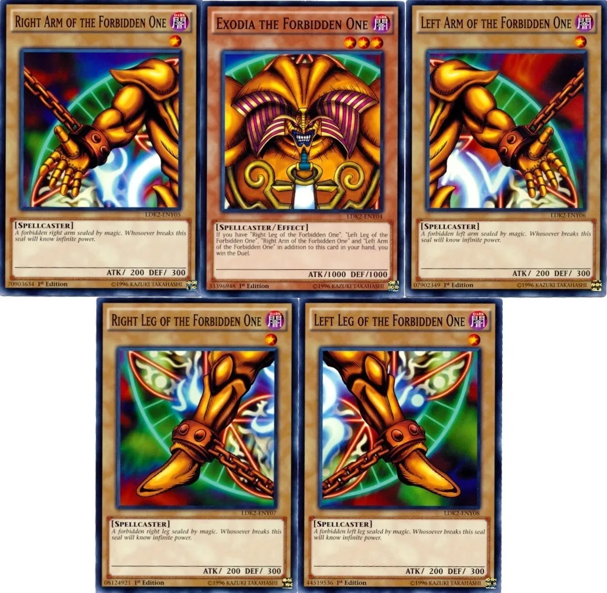

# TP3 - Machine Learning II

## Modalidad del TP

Deberán proponer un tema de investigacion / implementacion similar a alguna de las tareas presentadas presentadas a continuacion y desarrollarla incluyendo:

* Un baseline
* Un dataset de validation/test para todos los experimentos
* Al Menos una implementación de alguna de las siguientes:
    * Redes neuronales
    * Reducción de dimensiones
    * Clustering
    * Generative Ai

El tema por mas que sea de libre eleccion debera ser de algo que no tenga solucion previa, es decir, no se busca una simple implementacion de algo. Asimismo, debera ser validado con algun ayudante antes de realizar el tp: **No se aceptan TPs que no hayan sido validados previamente**.

Por sobre eso se valora el uso de cualquier técnica de machine learning novedosa y potencialmente útil. La idea es hacer una **POC: Proof of concept**.

## Formato de entrega

El formato de entrega es un video de **no más de 5 minutos** explicando que se intentó, por qué y resultados. Junto con eso se deberá entregar el código y todo el desarrollo correspondiente. **Videos de más de 5 minutos serán descartados y la nota del TP será 0.**

Se le preguntara si da permiso para compartir el video, de aceptar le pedimos lo suba a youtube.

## Criterio de evaluación

La nota es a criterio del equipo docente donde todos serán correctores de todo (promediando el puntaje de varios), sobre una base de 2 puntos como máximo que sumarán de forma directa al promedio que se tenga en la materia. Por ejemplo, si su promedio de cursada es 8.75 y saca 1.5 puntos en el TP3 su promedio de cursada es 10.25.

## Correctores y consultas

Este TP no tiene correctores individuales asignados, todas las consultas, sean o no de código corresponden al canal #consultas-tp3 o al ayudante que prefieran, también pueden ayudarse entre ustedes.
Lo más normal es que no tengan idea de qué hacer en su tarea y es la idea que prueben cosas algo distintas. Después de investigar un poco que se puede usar, pueden preguntar en el canal de consultas para que les demos sugerencias sobre qué probar o que es una buena idea y cuál no.

# Tareas de ejemplo

## Detección de typos en código

Tomando [este dataset](https://github.com/mhagiwara/github-typo-corpus) de typos en commits de github se extrajeron textos de código (no documentación) corregidos por usuarios en commits de github. El [dataset reducido](https://gianmarco.com.ar/downloads/github_typo/typos.parquet) tiene más de 69mil textos con las posiciones de los caracteres que fueron modificados.

### Tarea 1: Calcular la probabilidad de que un caracter esté mal escrito

Tomando los textos mal escritos y sus posiciones como secuencias de caracteres, es posible predecir qué caracteres van a ser modificados? ¿Cuál es el mejor AUC-roc que se puede conseguir? Utilizar el dataset reducido.

## Manejo de imágenes de juegos de cartas

Se dispone de una [base de datos](https://github.com/ProjectIgnis/BabelCDB/raw/master/cards.cdb) con información de las cartas del juego Yu-Gi-Oh! (en [este archivo](https://github.com/NaimSantos/DataEditorX/blob/master/DataEditorX/data/cardinfo_english.txt) se encuentra la traducción de los datos) y una [colección de imágenes](https://drive.google.com/file/d/1JYhe4ajT_USEmqbNFkoBnQaiWuvNFn0c/view?usp=sharing) de dichas cartas.

### Tarea 2: Crear un símil style transfer

El _style transfer_ permite generar imágenes nuevas en base a una imagen y un determinado estilo. En este caso, se busca que dada la imagen de una carta y un subset de características, se genere una nueva imagen que represente las características ingresadas.
¿Hay features que sean más importantes que otras para lograr resultados apreciables?¿Es el tamaño de la imagen determinante para el resultado final?

### Tarea 3: Embeddings de imágenes

Proponer un embed para las imágenes de las cartas, que permita mediante KNN maximizar la cantidad de atributos que se pueden inferir de la misma.
¿Es posible con el embed propuesto determinar si dos cartas son la misma solo que con arte distinto? ¿Se puede identificar un límite inferior para el largo del embedding, debajo del cual deja de servir? ¿Y un límite superior desde el que deja de tener sentido tener un embedding?

## Trading

Tenemos dos conjuntos de datos de [_alphavantage_](https://www.alphavantage.co/), uno de [valores de acciones en intervalos de 1 minuto](https://www.kaggle.com/datasets/nickdl/snp-500-intraday-data?resource=download) y otro de [valores de criptomonedas en intervalos de un día](https://drive.google.com/file/d/1gAIAyl2KVZ4Iy426O5QrqUn45C9ry5ZA/view?usp=sharing).

### Tarea 4: Predicción de acciones a tomar en micro trading

Generalmente las acciones de predicción en trading están ligadas a predecir el precio de una acción específica. En este caso se plantea no predecir el precio, sino que dada una cartera (dinero + acciones), se sugieren los movimientos a realizar durante un dia (en _tiempo real_<small>*</small>) para maximizar la ganancia. Los movimientos se definen en términos de: se debe comprar / vender / holdear; cuanto se debe comprar o vender; a qué precio se debe comprar o vender.

<small style="font-size: 10px">**\*Tiempo real**: en un contexto de microtrading, el tiempo que tardamos en realizar los movimientos importa en el resultado. Para el TP, asuman que en T1 se puede sensar (tomar un input de cualquier tiempo menor o igual a T1), en T2 toma una acción y en T3 se ve el resultado. </small>

Para las operaciones considerar:
* Compra
  * La operación es exitosa si el valor al que se quiere comprar está por sobre el mínimo operado en T3
  * Definimos una pérdida en términos de cuánto más caro pagamos la acción respecto del mínimo operado en T3
* Venta
  * La operación es exitosa si el valor al que se quiere vender esta por debajo del máximo operado en  T3
  * Definimos una pérdida en términos de cuánto más barato vendimos la acción respecto del máximo operado en T3
* Hold
  * Definimos pérdida en términos del valor que tenían las acciones de la cartera en al inicio de T1 respecto de lo que valen al final de T3.
  * Si el valor en T1 es menor que T3 se lo define como una ganancia

### Tarea 5: Diversificación de carteras

Una variante de inversión más conservadora es diversificar la cartera en más de un tipo de instrumento. En particular, para alguien que no tiene mucho tiempo, es más fácil comprar al inicio de la rueda y vender al cierre. Utilizando el dataset de criptos, proponer para un día y un capital inicial, como debe distribuir el capital entre las diversas divisas a fin de maximizar la ganancia al final del día. Utilizando el mismo modelo, predecir para N días y un capital inicial cuanto es la ganancia. ¿Es posible definir un margen de error para esa predicción? ¿Para qué rango de valores de entrada se considera que el margen de error es aceptable?

## Stackoverflow

Tomamos una muestra de posts de stack overflow y sus respuestas del dataset utilizado [en este paper](https://data.ncl.ac.uk/articles/dataset/Machine_learning-based_detection_of_FLOSS_version_release_events_from_Stack_Overflow_message_data/12472859). Por un lado tenemos un parquet para [los posts en sí mismos](https://gianmarco.com.ar/downloads/floss_github/post_sample.parquet) y otro para [las respuestas de esos posts](https://gianmarco.com.ar/downloads/floss_github/answer_sample.parquet).

### Tarea 6: Predecir los tags de un post dado el contenido
¿Qué tan fácil es predecir los tags de un post dado su contenido? Utilice el sample de posts para realizar está tarea multilabel.

### Tarea 7: Predecir la popularidad de un post dado el contenido
Utilice el sample de posts para predecir en simultáneo la cantidad de comentarios, respuestas y favs que va a recibir.

### Tarea 8: Predecir a qué posts corresponde cada respuesta
Dado un post y una respuesta crear un predictor que con el contenido de ambas de la probabilidad de que esa respuesta corresponda a ese post. La métrica de validación es AUC-ROC.

## Tweets políticos y discriminatorios

Tenemos [tres datasets](https://data.mendeley.com/datasets/c2b8mj2hsf/1) de tweets, según si son políticos o no, o discriminatorios o no:
* Dataset_2.zip: Contiene tweets en inglés discriminatorios y no discriminatorios

### Tarea 9: Clasificación de tweets discriminatorios
Cree un clasificador para tweets discriminatorios. La métrica de validación es AUC-ROC. ¿Cómo conviene usar los débilmente clasificados?

### Tarea 10: Limpieza semi-supervisada del dataset de discriminación
Utilizando un método de clasificación semi-supervisada corrija los datasets débilmente clasificados. ¿Cúal es la accuracy del método?

## Espectrogramas de masa

Tenemos [un dataset](https://drive.google.com/file/d/17fVzfCrSgcQi62IUjFOnlmePH54W2nHO/view?usp=sharing) con los espectrogramas de masa para distintos compuestos orgánicos.

### Tarea 11: Predecir la cantidad de átomos de cada elemento

Queremos predecir la cantidad de átomos de cada elemento que tiene el compuesto utilizado. ¿Qué tan bien funciona en los compuestos con los que no entreno?

## Semeval 2023

La [Semeval](https://semeval.github.io/SemEval2023/tasks) es una competencia anual internacional de NLP. Hemos seleccionado algunas tareas que son realizables por ustedes para trabajar.

### Tarea 12: Clickbait challenge

Consiste en resumir notas clickbait. Pueden ver la docu y datos [acá](https://pan.webis.de/semeval23/pan23-web/clickbait-challenge.html).

### Tarea 13: Human Value detection

Es un problema de detección multiclase de valores humanos frente a argumentos. Pueden ver la docu y datos [acá](https://touche.webis.de/semeval23/touche23-web/index.html).

### Tarea 14: Multilingual twit intimacy analysis

Regresión sobre la "intimidad" de varios twits. Pueden ver la docu y datos [acá](https://sites.google.com/umich.edu/semeval-2023-tweet-intimacy/home).

### Tarea 15: Detección y clasificación de sexismo en internet

El objetivo es detectar y clasificar distintos tipos de sexismo en textos. Pueden ver la docu y datos [acá](https://codalab.lisn.upsaclay.fr/competitions/7124#learn_the_details-label-schema).
