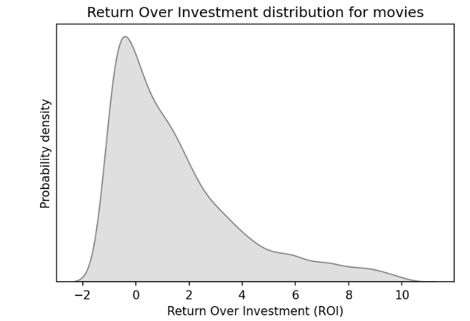
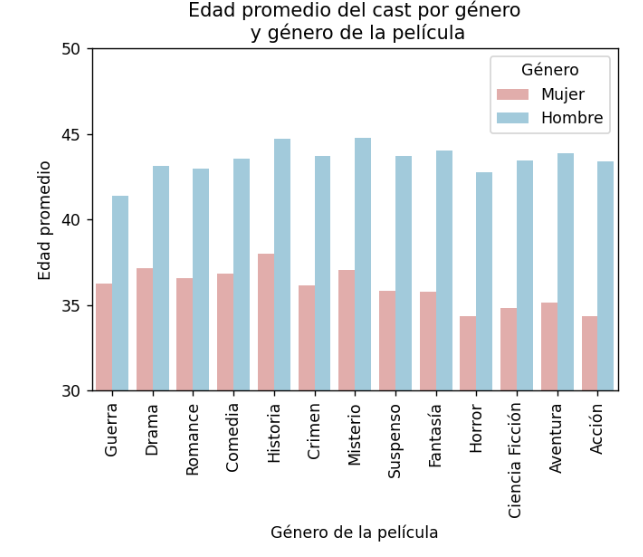
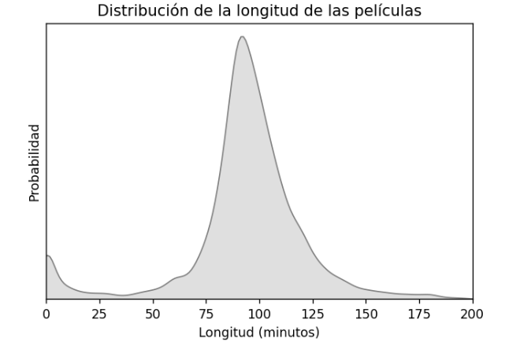
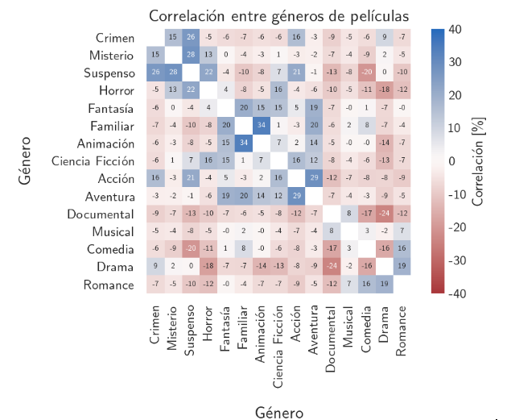
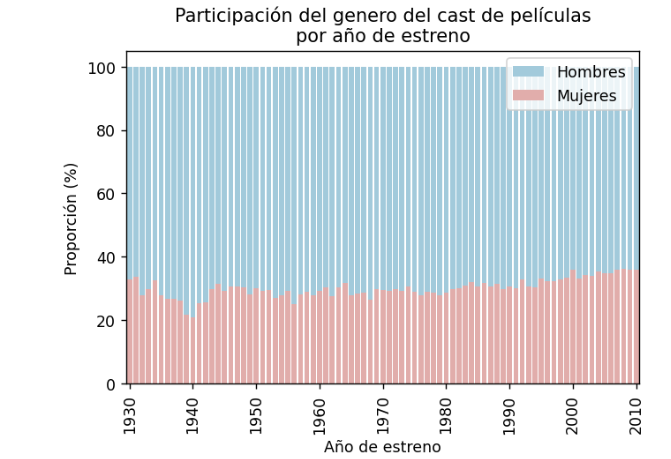
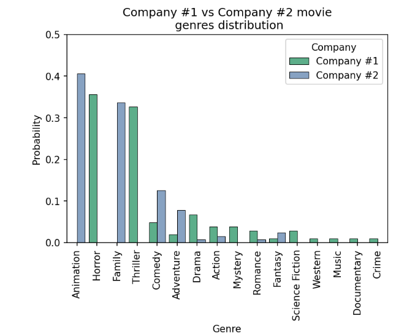
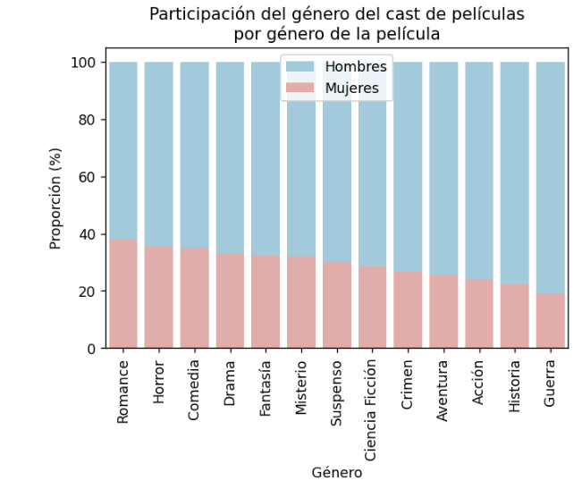

# Ejercicios de Pandas, Spark y Visualización

El dataset se encuentra en: https://drive.google.com/drive/folders/1fOBnuxITZSsbChHfmrvw8rQt_D_SyJ18?usp=sharing

Es una mezcla del dataset de “the movie database” para 45mil películas y datos de imdb.

## Descripción del dataset
#### Movies.csv
- adult: 😏🥵
- belongs_to_collection: Nombre de la colección a la que pertenece la película
- budget: presupuesto
- genres: géneros separados por coma
- homepage: web de la peli
- id: id de la peli
- imdb_id: id de la película en imdb
- original_language: idioma original
- original_title: título en el idioma original
- overview: descripción de la película
- popularity: popularidad
- poster_path: ruta a la imagen del poster
- production_companies: id de las empresas que produjeron la película, separadas por comas
- production_countries: países donde se produjeron las películas
- release_date: fecha de estreno
- revenue: ingresos que generó
- runtime: largo total en minutos
- spoken_languages: idiomas que se hablan en la película
- status: estado de la película
- tagline: eslogan
- title: título en inglés
- video
- vote_average: promedio de calificaciones
- vote_count: cantidad de votos
#### cast.csv
- id: id de película en la que participó
- cast_id: id de la persona
- character: personaje que hizo
- name: nombre
#### crew.csv
- id: id de la película en la que participó
- crew_id: id de la persona
- department: departamento en el que trabajo
- job: título de su trabajo
- name: nombre
#### companies.csv
- id: id de la compañía
- name: nombre
- keywords.csv
- id: id de la película
- keywords: palabras clave separadas por coma
#### ratings.csv
- userId: user que dejó el rating
- movieId: película donde lo dejó
- rating: el rating que dejó, del 1 al 5
- timestamp: timestamp de cuando dejó el rating
#### imdb_actors.csv
Es un csv extra que sale de imdb que contiene información de muchos actores y actrices.
- nconst: id de la persona
- primaryName: nombre
- birthYear: año de nacimiento
- deathYear: año de muerte
- primaryProfession: profesiones principales separadas por comas
- knownForTitles: ids de imdb por los cuales se lo conoce, separado por comas
#### links.csv
- movieId: un ID único para cada película
- imdbId: el id de imdb de esa película
- tmdbId: el ID de “the movie database” que aparece en la mayoría de las otras tablas

## Enunciados
### Pandas
#### Nivel uno
1. ¿Cuáles son las 5 lenguas en las que más ganancia neta genera la industria aproximado por los datos propuestos? y las 5 que menos? (ganancia neta = ganancia - inversión) 
2. De las 10 películas más populares, ¿cuál es el título de la película que tiene más géneros asociados? ¿Cuáles son esos géneros? 
3. ¿Cuál es la película con el mayor ratio ingreso por minuto? ¿Y el cortometraje? Dar nombres y ratios. Criterio: Película > 30min>= Cortometraje >= 5min. 
4. ¿Cuál es el nombre del actor o actriz que participó en más películas en un rol que no sea de voz (‘voice’)? ¿En cuántas películas trabajó? ¿De quién se trata y por qué es conocida? 
5. Para las películas que duran más de tres horas, ¿cuál es la película con más ROI? 
6. Para las películas que contienen el género de acción, si las separamos entre películas antes del 2000 y después del 2000, ¿cuál es el promedio de cantidad de votos para cada etapa? 
7. ¿Cúal fue el año más mortal para los actores y actrices? 
8. ¿Cuál es el nombre de la película con mayor cantidad de empleados contratados para trabajar en Efectos Visuales? 

#### Nivel dos
1. Se desea encontrar a los 10 usuarios menos objetivos. Se considera a un usuario poco objetivo cuando sus calificaciones a las películas están muy alejadas de la media. 
2. Según los cinéfilos, ¿cuál es el rating promedio de las 5 películas más populares? Un usuario es cinéfilo cuando puntuó más de 50 películas y todas las puntuaciones son de más de 2.5 estrellas. Indicar id, título, popularidad y rating promedio de la película. 
3. Top 10 películas Argentinas según vote_average que contengan el género drama con más de 100 reviews en ratings (dar géneros, cantidad de reviews en ratings, título, y vote_average). 
4. Queremos saber quién de los 2 actores le gusta más a la gente, si Guillermo Francella o Ricardo Darin, para eso queremos saber quien tiene en promedio mejor vote_average en movies.csv. 
5. ¿Cuál es el nombre del mejor actor o actriz de todos los que participaron en más de 10 películas? Se considera un actor mejor que otro cuando el promedio de las calificaciones promedio de las películas en las que participó es mayor que el de otro actor o actriz.
6. ¿Cuál es la probabilidad de que una película de un género en particular tenga una calificación promedio mayor a 7? Obtenga las probabilidades de cada género posible.
7. Al parecer hay personas que además de actuar en una película también trabajaron en ella desde algún otro rol. ¿Cuál de estas personas es la que más trabajos tuvo en una misma película? Indicar el nombre de la película, el nombre de la persona y la cantidad de trabajos que tuvo. 
8. ¿Cuáles son los actores o actrices que hicieron más películas en una misma década según la década en la que más hicieron? ¿En qué posición del top está Nicolas Cage?
9. Construya la matriz que dadas dos productoras la posición i,j contenga la cantidad de veces que la productora i trabajo con la productora j. Considere solo productoras con más de 5 películas. Obtenga con esa matriz la matriz de correlación. Responda: 
10. ¿Cuáles son las 5 productoras que trabajaron con más productoras distintas?
11. ¿Cuáles son las productoras que siempre trabajan juntas?
12. ¿Cuál es el género con más películas cada década? ¿Y la keyword para cada década?

#### Nivel tres
1. Queremos hacer una película que incluya al mejor empleado para cada categoría de la tabla crews como líder de equipo. Para los empleados que participaron en más de 5 películas considerando el promedio de ratings de las películas en las que participaron, ¿Cúal es el mejor de cada tupla (department, job)? Con este mismo criterio, consiga un top 5 de actores y top 5 de actrices para el elenco de la misma. Con este mismo criterio queremos también el tema de la película, ¿cuáles son las 4 mejores keywords?

### NLP
#### Nivel uno
1. ¿Cúal es la descripción con mayor ratio de stopwords? 
2. Removiendo stopwords, ¿Cúal es el top 10 stems más comunes? 

### Nivel dos
1. ¿Cúal es el top 10 adjetivos más comunes en las descripciones de las películas? 
2. ¿Cúal es el top 10 palabras con mayor popularidad promedio, sin contar stopwords? 
3. Queremos predecir el género de la película según su descripción. Para esto vamos a buscar para una descripción nueva los 10 vecinos más cercanos y asignar el género que más se repita entre ellos. Pruebe este algoritmo para 5 películas al azar y para una descripción inventada que se le ocurra para una película nueva de Disney. 
4. Dado el ROI de las películas, para aquellas cuyo ROI (Return of Investment) esté entre -10 y 10. ¿Cúal es el top 10 palabras que aparecen más de 5 veces y no son stopwords que generan mayor ROI promedio según su aparición en las descripciones? 
5. Encuentre, para cada película, cuál es la más cercana en términos de distancia coseno respecto de las keywords. Muestre 5 pares aleatorios con sus descripciones. 
6. Queremos analizar qué tan fácil sería hacer un slogan para las películas en base a su descripción con machine learning. La primera pregunta consiste en entender: ¿Qué porcentaje de las palabras que no son stopwords de las que aparecen en los slogans aparecen también en la descripción? ¿Y qué porcentaje de las tuplas de dos palabras cumplen eso? ¿Y tuplas de tres? A mayores los porcentajes, más fácil será generar el slogan con la descripción.  

#### Nivel tres
1. La primera regla del club del cine es que no se habla del club del cine: queremos utilizar las reviews de las películas para emparejar personas cinéfilas. Dadas las descripciones de las películas que le gustaron (calificación >3) a un usuario y las que no le gustaron (calificación <3) construya dos vectores con tf-idf. Busque para cada usuario, utilizando la concatenación de estos vectores, al usuario más similar. No utilice los usuarios que tienen menos de 30 reviews, ya que no son verdaderos fans del cine. ¿De qué tamaño es el conjunto conexo y poligámico más grande? ¿Quién es el usuario con más parejas?

### Spark
#### Nivel uno
1. De las 10 películas más populares, ¿cuál es el título de la película que tiene más géneros asociados? ¿Cuáles son esos géneros?
2. ¿Cuál es el nombre del actor o actriz que participó en más películas en un rol que no sea de voz (‘voice’)? ¿En cuántas películas trabajó? ¿De quién se trata y por qué es conocida?
3. Para las películas que duran más de tres horas, ¿cuál es la película con más ROI?
4. Para las películas que contienen el género de acción, si las separamos entre películas antes del 2000 y después del 2000, ¿cuál es el promedio de cantidad de votos para cada etapa?
5. ¿Cuál es el nombre de la película con mayor cantidad de empleados contratados para trabajar en Efectos Visuales?
6. ¿Cuál fue el año más mortal para los actores y actrices?
7. ¿Cuál es la descripción con mayor ratio de stopwords?
8. ¿Cuál es la entropía base 2 de la distribución del rating que dan los usuarios?

#### Nivel dos
1. Según los cinéfilos, ¿cuál es el rating promedio de las 5 películas más populares? Un usuario es cinéfilo cuando puntuó más de 50 películas y todas las puntuaciones son de más de 2.5 estrellas. Indicar id, título, popularidad y rating promedio de la película.
2. Top 10 películas Argentinas según vote_average que contengan el género drama con más de 100 reviews en ratings.csv (dar géneros, cantidad de ratings, título, y vote_average).
3. Si decimos que un usuario es adyacente a otro cuando le dieron un rating a una misma película. ¿Cuántos usuarios son adyacentes al 179792? ¿Cuántos son adyacentes a sus adyacentes?
4. ¿Cuál es el usuario cuya velocidad promedio para hacer ratings es mayor?
5. ¿Cuál es el nombre del mejor actor o actriz de todos los que participaron en más de 10 películas? Se considera un actor mejor que otro cuando el promedio de las calificaciones promedio de las películas en las que participó es mayor que el de otro actor o actriz.
6. ¿Cuáles son los actores o actrices que hicieron más películas en una misma década según la década en la que más hicieron? ¿En qué posición del top está Nicolas Cage?
7. ¿Cuál es el género con más películas cada década? ¿Y la keyword para cada década?
8. Top 10 3-uplas de palabras más populares en las descripciones de las películas removiendo stopwords.
9. Para las películas con exactamente 7 keywords, ¿cuál es la más popular?
10. Para las películas que tengan en su descripción “in a world”(sin importar las mayúsculas) cuales son las 10 tuplas de palabras en sus descripciones más populares?
11. Nombre de la productora, película, popularidad, y id de productora, de la película más popular.
12. ¿Cuál es el usuario más pesimista (menor rating promedio) para cada género de películas? Considere solo usuarios con más de 20 reviews
13. ¿Quién es el usuario con más y menos entropía base 2 de la distribución de ratings que hicieron? ¿Y el de menos? ¿Cuáles son esas distribuciones?
14. Queremos saber cual es el mayor fan de Brad Pitt. ¿Quién es la persona que mejor puntúa en las películas en las que aparece? Considerar las películas no puntuadas como con score 0.
15. Tenemos la teoría de que hay actores importantes que se odian pero no se sabe. Para los actores aún vivos o que murieron después del año 2000, hallar el par de actores que más compañías compartieron sin compartir películas.
16. Estimamos el sueldo de un actor como la inversión dividida entre la cantidad de actores. En base a esta estimación, ¿cuál es el actor con el patrimonio más grande?
17. Asesoramos a un inversionista de la industria cinematográfica y este necesita bajar el riesgo en sus actividades. Cual es el top 3 de compañías con el mayor ROI por película?

#### Nivel tres
1. ¿Cuál es la probabilidad de que una película de un género en particular tenga una calificación promedio mayor a 3 (utilizando la tabla de ratings)? Obtenga las probabilidades de cada género posible.
2. Si consideramos la antigüedad de un usuario como la diferencia entre el tiempo en el que hizo el primer rating y la última. ¿Cúal es el usuario más antiguo? ¿Cúal es la correlación entre la antigüedad de cada usuario y la cantidad de reviews que hizo? Calcule la correlación de forma distribuida.
3. Uno tendería a pensar que mientras más personas participan de una película, más cara es. ¿Cuál es la correlación de Spearman entre estos números? Calcule de forma distribuida.
4. Obtenga un vector que indique si una compañía trabajo/no trabajo en una película, para cada película. Para cada compañía utilice estos vectores para buscar cuál es la compañía más similar, utilizando la distancia coseno. Imprima toda la lista de tuplas (compañía, similar).

### Visus
#### Nivel uno
1. Calcule el ROI (Return of Investment) de cada película. Filtre aquellos entre -10 y 10 y consiga la siguiente visualización.

  

2. Reproduzca exactamente esta visualización:

  

3. Reproduzca exactamente esta visualización:

  

#### Nivel dos
1. Reproduzca exactamente esta visualización:

  

2. Utilizando la tabla de imdb_actors para estimar los géneros, realice la siguiente visualización. La misma debe tener el mismo estilo y rangos pero puede variar ligeramente debido a supuestos al aproximar valores.

  

#### Nivel tres
1. Consiga la probabilidad de que una productora haga una película según el género para cada uno de los géneros. Para las productoras con participación total mayor a 100 en géneros, ¿cuáles son las dos productoras con más distancia coseno respecto de sus probabilidades? Realice este plot reemplazando los nombres de las productoras por los que corresponden.

  

2. Utilizando la tabla de imdb_actors para estimar los géneros, realice la siguiente visualización. La misma debe tener el mismo estilo y rangos pero puede variar ligeramente debido a supuestos al aproximar valores. 

  

