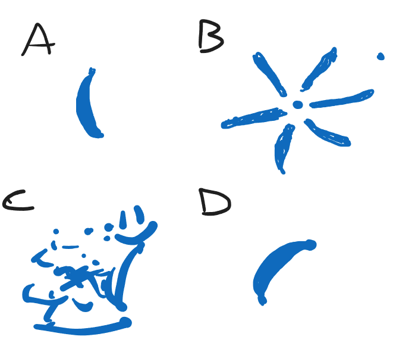

# Guía de reducciones

## Ejercicio 1

Determinar si las siguientes afirmaciones son V / F justificando la respuesta:
1. Tenemos una matriz con las calificaciones de películas x usuario. La matriz es de 50000 películas por 150000 usuarios. La dimensionalidad intrínseca de este set de datos seguramente es menor a 150000.
2. La SVD puede usarse tanto para reducir las dimensiones de un conjunto de puntos como para reducir la cantidad de puntos en un set de datos.
3. Si queremos representar un set de datos en dos dimensiones para visualizarlo entonces la SVD es siempre la mejor opción.
4. Si tenemos una matriz de mxn y queremos reducirla a k dimensiones entonces podemos aplicar la SVD y luego calcular X=U*S*V(t) y quedarnos las primeras k columnas de X
5. Si sabemos que la dimensionalidad intrínseca de los datos es 1 entonces podemos aplicar la SVD y quedarnos con la primer columna de U para representar a los mismos.

## Ejercicio 2

Reducimos la cáscara 3D de una banana (solo puntos de la cáscara, no el volumen interno) utilizando distintos algoritmos de reducción de dimensiones.
¿Cúal es la asginación algoritmo-dibujo más probable?

`[ ]`  A y C de SVD; D de uMAP

`[ ]`  B y C de SVD; A y D de uMAP

`[ ]`  A y D de PCA; B de t-SNE

`[ ]`  A, C y D de ISOMAP; B de PCA

`[ ]`  B y C de SVD; A y D de PCA
