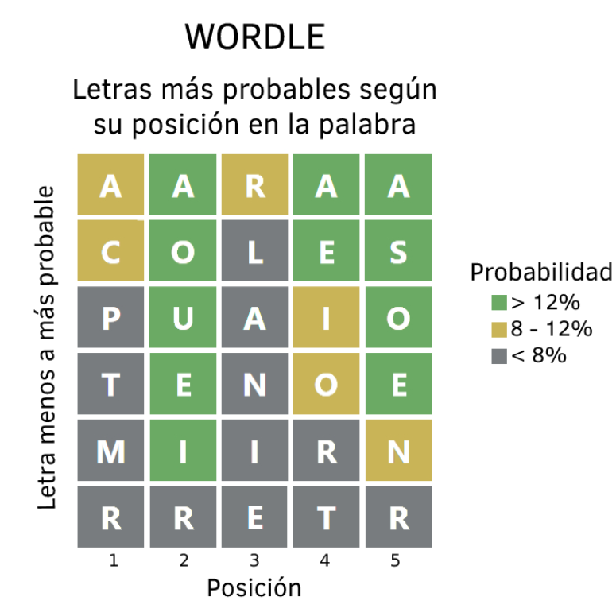
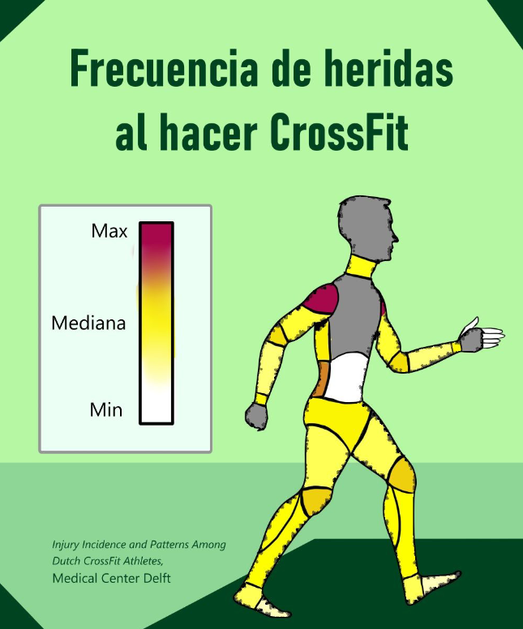
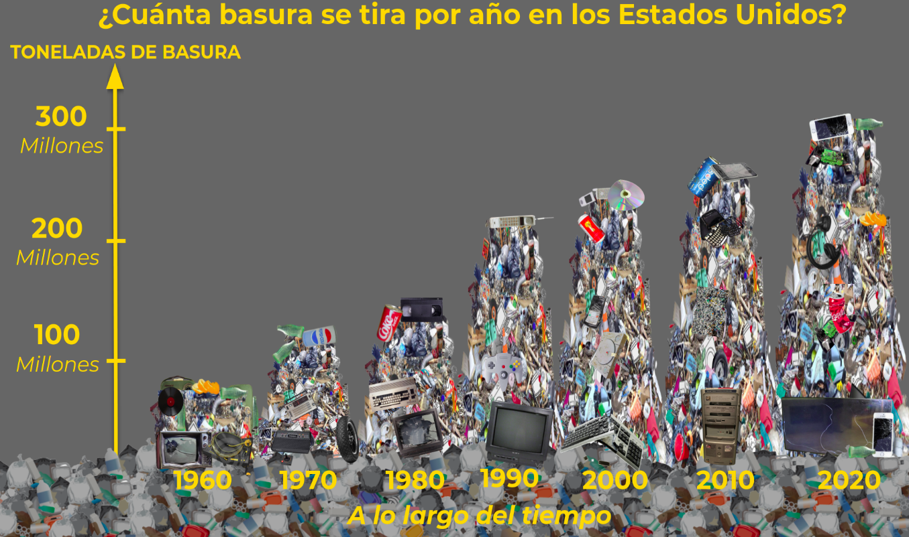
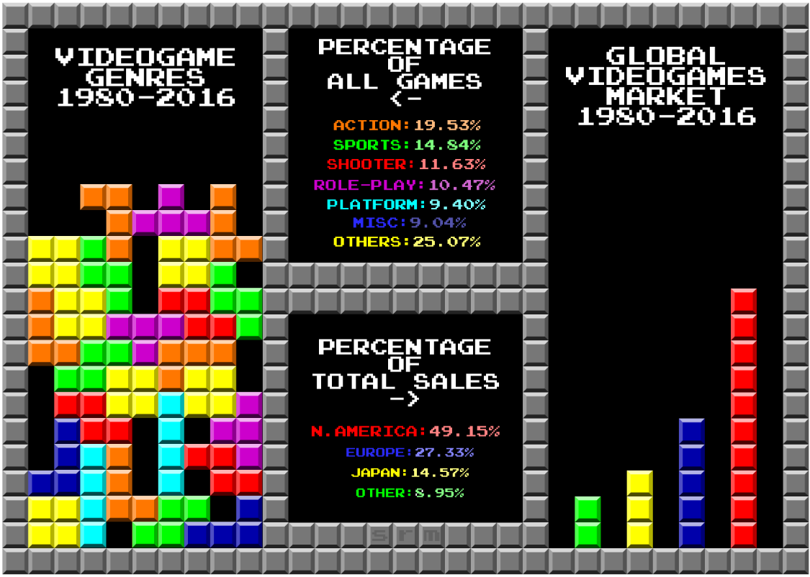
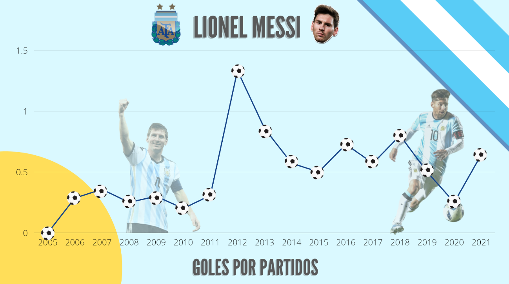
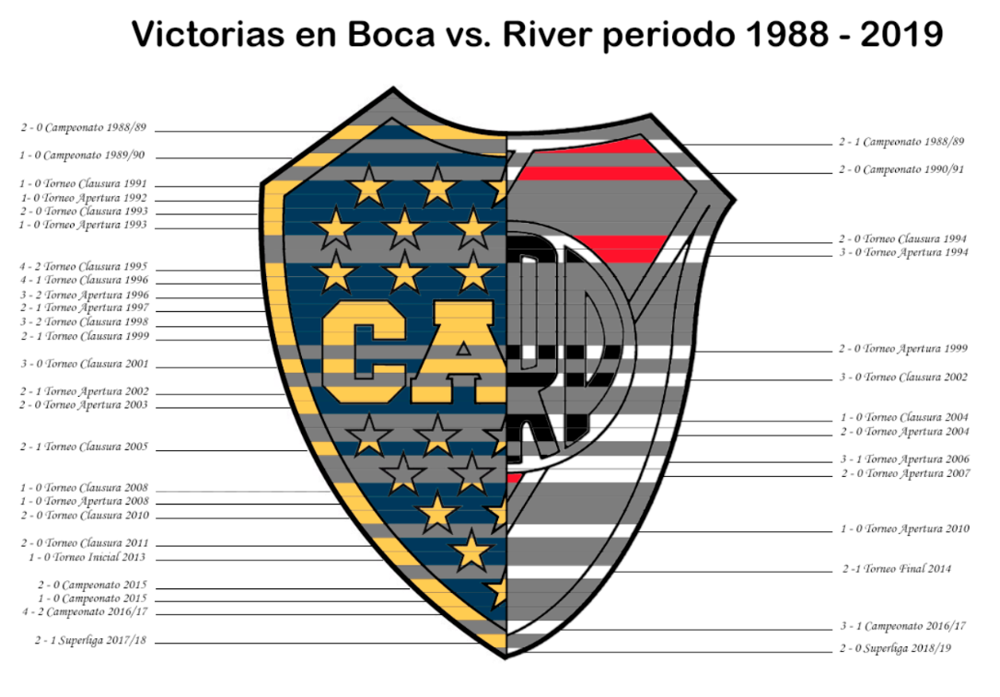
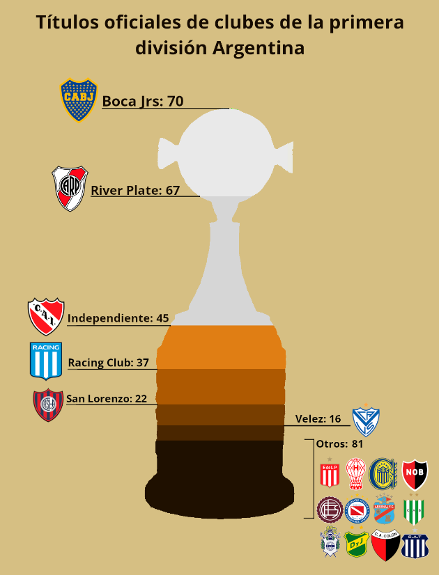

# Visualizaciones destacadas

Como parte del desarrollo del TP1 pedimos una visualización original, aquí destacamos algunas de cuatrimestres pasados que nos gustaron.

## 1er cuatrimestre 2022

* Wordle (Melina Lazzaro)

* Nadadores por medallas olímpicas (Nahuel Nicolas Gomez)

* Crossfit (Maria Pont)

* [Consumo de cerveza en el mundo](https://www.youtube.com/watch?v=7FeheVsOiiQ)

* Huella de carbono (Marcelo Rondán)

* Marvel vs DC (Ariana Salese)

## 2do cuatrimestre 2021

